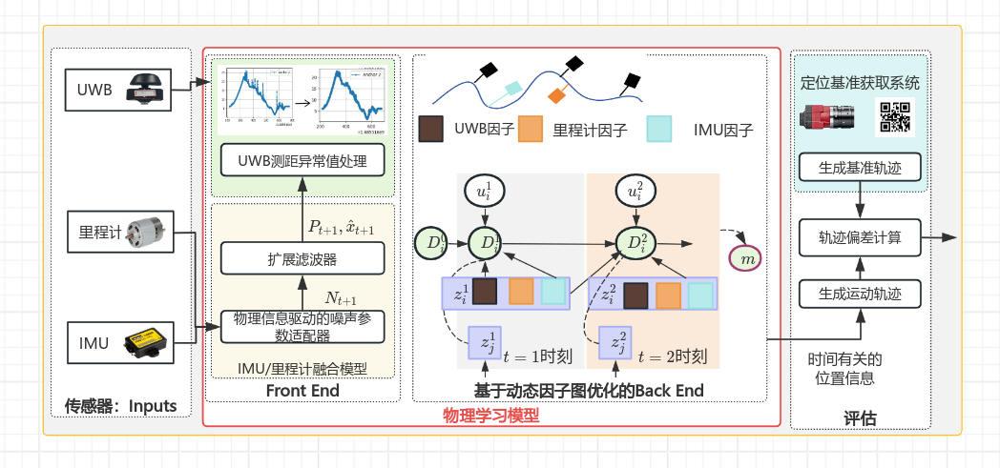

## 模型图
- processon网址：https://www.processon.com/diagraming/67addf32031d2d5b129944cd
- 2025.03.25：

## 方案参考
- 3_1AI-IMU（有代码）
    - 深度神经网络处理IMU数据，提高IMU数据有效性
    - **考虑直接给IMU数据处理结果** （2025.4.1）
- 4_1CT-UIO（无代码）
    - 总体框架：
        - 前端：传感器数据预处理
        - 后端：因子图优化
        - 轨迹建模：B样条， 窗口分段处理
- 5_1SFUISE（有代码）
    - sfuise框架
        - 估计接口：传感器数据预处理
        - 样条融合：样条窗口建模，线性化残差（构建Hessian和梯度），LM算法迭代优化（残差项优化）

- 因子图建模部分？？
---

### **因子图与LM的协作流程**
在基于因子图的优化框架中（如GTSAM、g2o），LM算法通常作为底层优化器：

#### **步骤1：构建因子图**
- 将传感器数据（IMU、视觉、测距等）转换为因子节点，连接到对应的变量节点。
- 例如：
  - IMU预积分因子约束相邻位姿。
  - TDOA/TOA测距因子约束节点位置。

#### **步骤2：线性化残差（构建Hessian和梯度）**
- 对每个因子 \( f_i \)，计算其残差 \( r_i \) 的雅可比矩阵 
- 累加所有因子的贡献，构建全局Hessian矩阵和梯度 

#### **步骤3：LM迭代优化**
1. 求解增量方程
2. 步长评估
3. 收敛判断

---

## CT-UIO中的因子图

- **变量节点** 
    - **非均匀B样条控制点**：用于连续时间参数化系统的状态（如位置、姿态、速度等）。样条的节点间隔根据传感器数据的时间戳动态调整，以平衡精度与   算效率。
    - **IMU偏差**：包括加速度计和陀螺仪的零偏，建模为随机游走过程。
    - **UWB锚点位置**：在锚点数量较少时，将其位置作为优化变量（而非固定先验），增强定位鲁棒性。
    - **传感器外参**：UWB与IMU/里程计之间的时空标定参数（如时间偏移、空间位姿变换）。

- **因子节点**
    - **IMU预积分因子**：  
      - 基于连续时间样条的导数计算IMU的角速度和加速度残差，通过预积分技术减少重复计算。
      - 利用李群李代数避免姿态参数奇异性，构建惯性运动约束。
    
    - **UWB测距因子**：  
      - 基于时间差到达（TDOA）或到达时间（TOA）模型，计算预测与实测信号传播时间差。
      - 在锚点稀疏场景中，引入几何约束增强可观测性（如利用多路径抑制策略降低噪声影响）。

    - **里程计因子**：  
      - 编码轮速或视觉里程计的相对运动测量，提供局部位姿变化的约束。
      - 通过连续时间样条插值，对齐异步的里程计与IMU数据流。

    - **时空标定因子**：  
      - 联合优化UWB与IMU/里程计的时间同步误差和空间外参。
      - 通过样条插值统一不同传感器的时间基准，避免离散时间模型的累积误差。

    - **先验因子**：  
      - 初始化阶段或滑动窗口边缘化时，保留历史状态的先验信息矩阵，维持优化问题的稀疏性。

---
- **因子图构建步骤**：  
  1. **数据对齐**：通过样条插值将UWB、IMU、里程计数据统一到连续时间域。
  2. **残差计算**：对每个传感器数据点，基于样条状态计算预测值，并与实际观测值构建残差项。
  3. **稀疏化处理**：利用边缘化技术（如Schur补）压缩历史状态信息，保持Hessian矩阵的稀疏性。
  4. **联合优化**：使用Levenberg-Marquardt算法迭代求解所有变量节点的最大后验估计。
