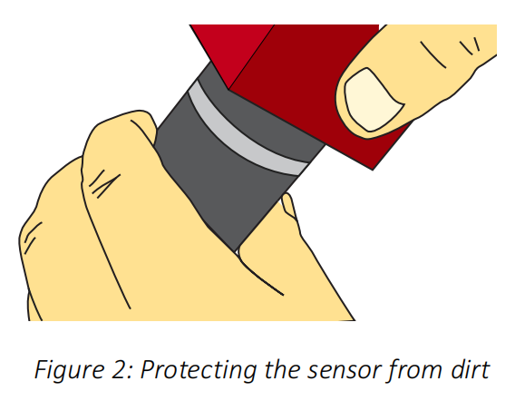

### 准备物品
- ~~绝缘手套~~（有封闭式外壳，好像不必要）
- 镜头擦拭布（眼镜布）
- 小螺丝刀

### 待确认信息
- 相机外壳情况：无外壳/无完整封闭式外壳/有封闭式外壳
    - 已确认：有封闭式外壳

### 阅读标记（resource/Alvium-USB-Cameras_User-Guide.pdf）
- 中文安全说明：p14
- 其他相关信息下载网址说明：p16
- 实物尺寸展示：p225
- 目录页：p22
- 安全：p59
- 安装：p265开始，关键：p271,p276

### 安全注意
- 散热问题
- 确保相机里的传感器无尘，无水
    - 不要触碰相关区域，尽量倒置安装

### 镜头相关
#### 安装安全
- 安装前了解相机最大伸出度(11mm)
#### 传感器
- 传感器对过度辐射很敏感：聚焦的阳光、激光和 X 射线会损坏传感器。污垢和划痕也会损坏传感器。
- 保护传感器免受灰尘的影响，因为灰尘离传感器越近，污垢就越明显。此外，请保持后镜头清洁。握住相机，使镜头卡口朝地，以防止灰尘进入镜头卡口。
