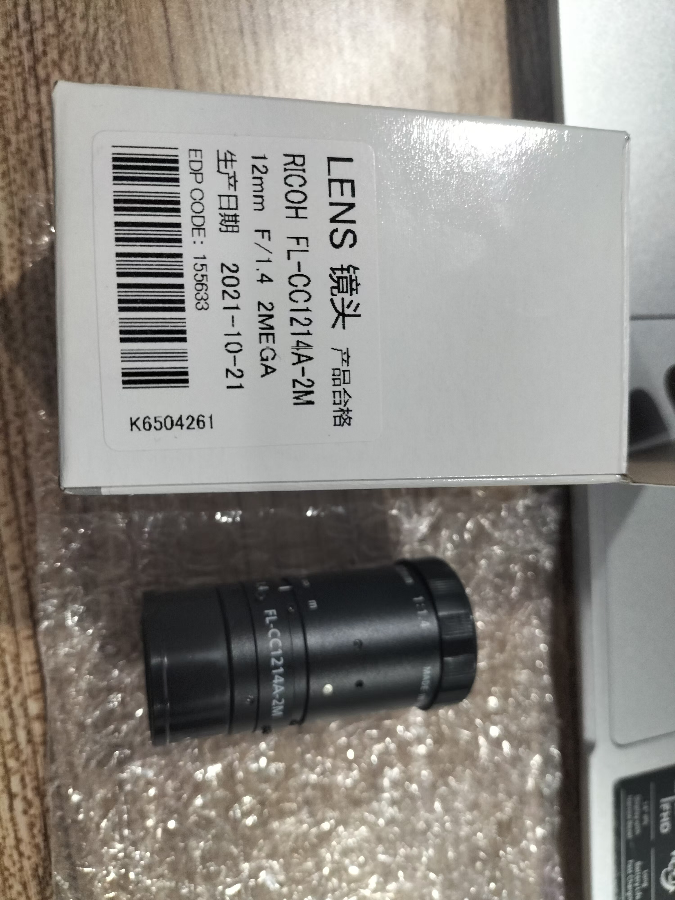

- 软件下载网址：https://www.alliedvision.cn/cn/products/software/vimba-x-sdk/
- 软件使用参考文档：resource/ALVIUM手册.pdf
- 具体操作在windows系统进行
- 用户指南：https://www.alliedvision.cn/cn/support/technical-documentation （USB）
    - 下载相机相关的说明文档
- 用户指南：resource/Alvium-USB-Cameras_User-Guide.pdf
    - 部分内容详细阅读：1_2_1相机及镜头使用指南阅读笔记.md
- 附加件说明文档：resource/Alvium-Modular-Concept_External.pdf
    - 有后面黑盖的是封闭外壳型号的
- 附加件说明网站：https://www.alliedvision.com/en/products/accessories
    - 下载镜头相关的说明文档
- c接口镜头介绍：resource/C-Mount-Lenses_User-Guide.pdf
    - 部分内容详细阅读：1_2_1相机及镜头使用指南阅读笔记.md
### 相机选型方案
1. 实物情况
- 实物图片：
- 实物型号：1800 U-510c
- 产品编码：17193
- 参考文档：resource/Alvium_1800_U-510c_Closed-Housing_C-Mount_Standard_DataSheet_zh.pdf
- 特点说明：
    - Closed-Housing，封闭外壳
    - C-Mount，接口类型
    - Standard USB，USB连接器类型
2. 参考相机选型网址：https://www.alliedvision.cn/cn/products/camera-selector/alvium-configurator/alvium-1800-u/510/#_configurator

3. 成像方案
- 成像方案文档：resource/成像方案1018.pdf
    - 文档对应黑白版本，实物采用彩色版本，其他参数一致

### 镜头选型方案
1. 实物情况
- 实物图片：
- 实物型号：Ricoh FL-CC1214A-2M
- 参考文档：resource/FL-CC1214A-2M.pdf

2. 参考镜头选型网址：https://www.alliedvision.cn/cn/products/accessories/lenses/?tx_avaccessories_accessory%5BcameraUid%5D=1741&tx_avaccessories_accessory%5BsubmodelUid%5D=8985&search=ricoh+FL-CC1214A-2M
