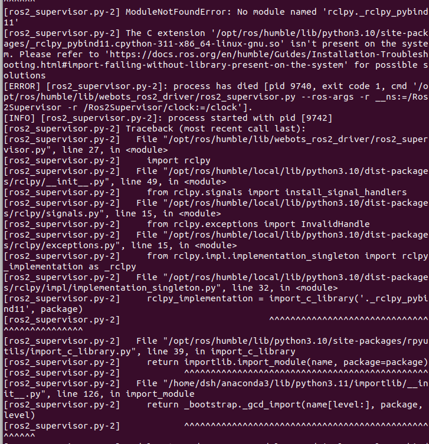
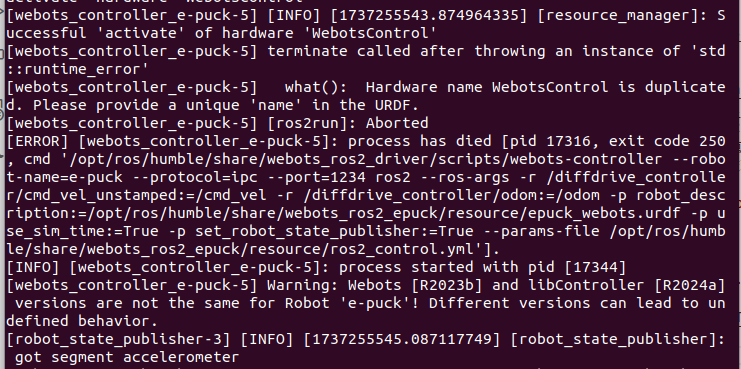
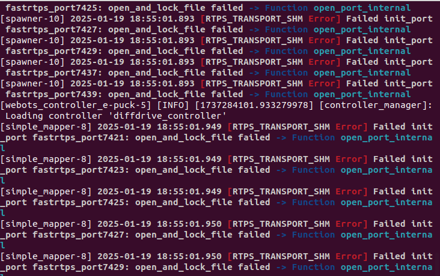

### 参考
- 飞书：https://ncnorqj58718.feishu.cn/wiki/PrlNw2GqziliBtk85vScxo2mnnd
- epuck教程：https://github.com/cyberbotics/webots_ros2/wiki/Tutorial-E-puck-for-ROS2-Beginners

### 环境安装
- 下载ros2 `humble`
- 下载webots `R2023b`
    - https://github.com/cyberbotics/webots/releases
    - `sudo dpkg -i 文件名.deb`
- 下载webots_ros2
    - https://docs.ros.org/en/iron/Tutorials/Advanced/Simulators/Webots/Installation-Ubuntu.html
    - `sudo apt-get install ros-humble-webots-ros2`
    - 出现错误：这个错误提示表明系统中的一些包存在依赖冲突或损坏，导致无法安装所需的包。特别是，`libdw-dev` 和 `libelf-dev` 包之间的依赖关系没有正确解析，导致安装失败。
        - 解决`sudo apt-get install libdw1=0.186-1build1 libelf1=0.186-1build1`
- 测试项目：
    - 参考：https://docs.ros.org/en/galactic/Tutorials/Advanced/Simulators/Webots.html

### 运行
- 运行` ros2 launch webots_ros2_epuck robot_launch.py rviz:=true nav:=true`
    1. 出现错误1：
        - 解决参考：https://docs.ros.org/en/humble/How-To-Guides/Installation-Troubleshooting.html
        - 解决方案：将python版本改为python10，如果修改失败了，检查退出conda
    2. 出现错误2：
        - 解决参考：https://github.com/cyberbotics/webots_ros2/issues/1015
    3. 出现错误3：
        - 解决参考：https://github.com/eProsima/Fast-DDS/issues/2790
        - `fastdds shm clean`
    4. 出现错误4： Navigation2 is not installed, navigation functionality is disabled（运行结果见log.txt）
        - 问题：没下载navigation模块
        - `sudo apt install ros-humble-navigation2 ros-humble-nav2-bringup`