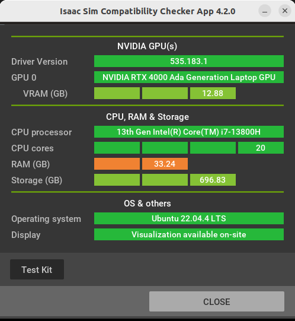
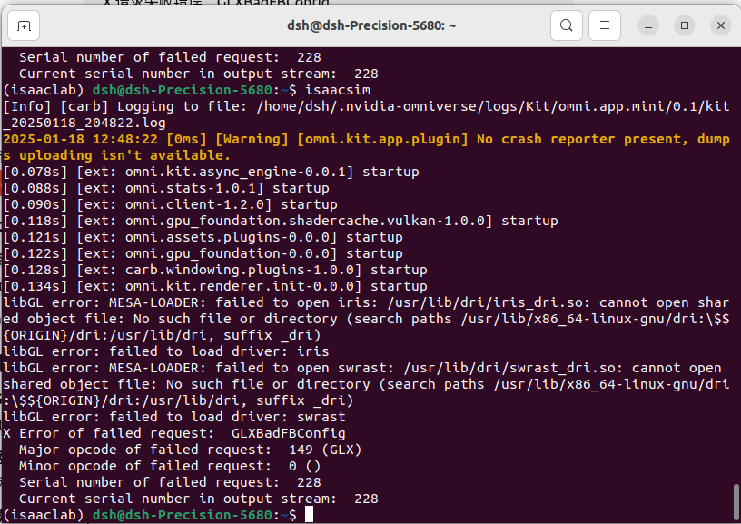
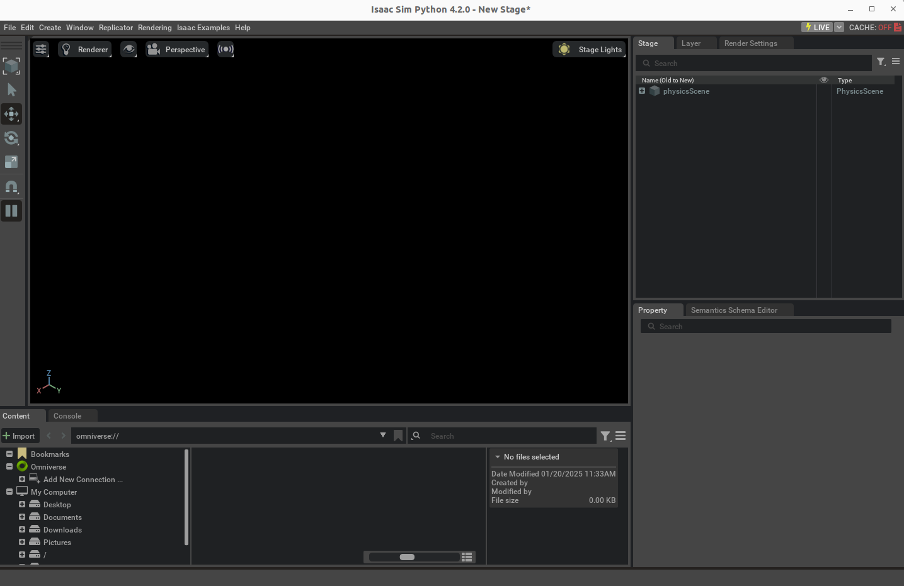

### 参考官方github：https://github.com/isaac-sim/IsaacLab

### 兼容性检测器
- 参考：https://docs.omniverse.nvidia.com/isaacsim/latest/installation/requirements.html#system-requirements
    1. 下载 Omniverse Launcher：https://developer.nvidia.com/omniverse#section-getting-started
    2. 安装过程遇到问题：
        - 
        - 解决办法：https://blog.csdn.net/zkf0100007/article/details/143645806
        
- 检测结果：
    - 

### 安装isaac-sim
- 参考：https://isaac-sim.github.io/IsaacLab/main/source/setup/installation/pip_installation.html
- 补充：
    - ` nvidia-smi`查看CUDA版本信息(本机为12.2)
    - `PyTorch `下载比较慢
- 遇到的问题
    - 运行`isaacsim`，出想错误
    - 解决方法：https://blog.csdn.net/weixin_43686259/article/details/141135736

### conda命令
- `conda create -n isaaclab python=3.10`
- `conda activate isaaclab`
- `conda deactivate`
- `conda env list`查看已经创建的conda环境

### 安装isaac-lab
- 参考：https://isaac-sim.github.io/IsaacLab/main/source/setup/installation/pip_installation.html
    - 安装位置记录：/home/dsh/Documents/isaac

- 安装依赖时，可能失败，自己单独安装
    - 例如，`pip install protobuf==4.25.5 -i https://pypi.tuna.tsinghua.edu.cn/simple`
    - 上面问题最终是通过科学上网解决的

- 下载完成验证：

