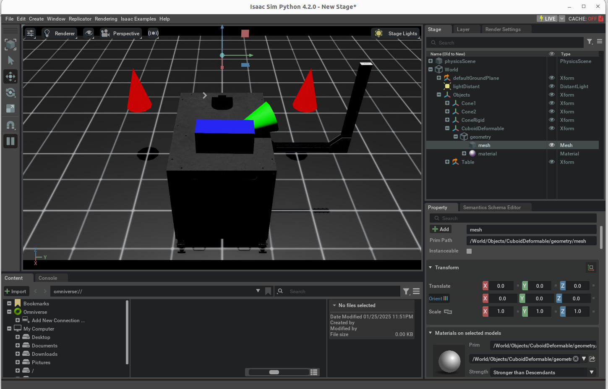

### 参考官方教程：https://isaac-sim.github.io/IsaacLab/main/source/tutorials/index.html

#### 0. isaac sim UI 和工作流程
- 参考：https://docs.omniverse.nvidia.com/isaacsim/latest/introductory_tutorials/tutorial_intro_interface.html#isaac-sim-app-tutorial-intro-interface

#### 1. 创建空场景
- 运行代码：进入isaaclab下载目录`/home/dsh/Documents/isaac/IsaacLab`，运行命令`./isaaclab.sh -p source/standalone/tutorials/00_sim/create_empty.py`
- 代码解析：code/tutorials/00_sim/create_empty.py

#### 2. 创建图元
- 进入conda `conda activate isaaclab`
- 文件位置：/home/dsh/Documents/isaac/IsaacLab
- 运行：`./isaaclab.sh -p source/standalone/tutorials/00_sim/spawn_prims.py`
- 代码解析：code/tutorials/00_sim/spawn_prims.py
- 运行结果：

- 问题1：
    - source/standalone/tutorials/00_sim/spawn_prims.py
[INFO] Using python from: /home/dsh/anaconda3/envs/isaaclab/bin/python         
Traceback (most recent call last):
  File "/home/dsh/Documents/isaac/IsaacLab/source/standalone/tutorials/00_sim/spawn_prims.py", line 20, in <module>
    from omni.isaac.lab.app import AppLauncher
ModuleNotFoundError: No module named 'omni.isaac.lab'
    - 解决：