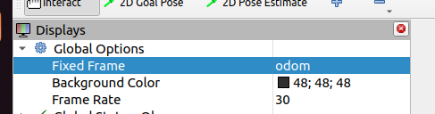
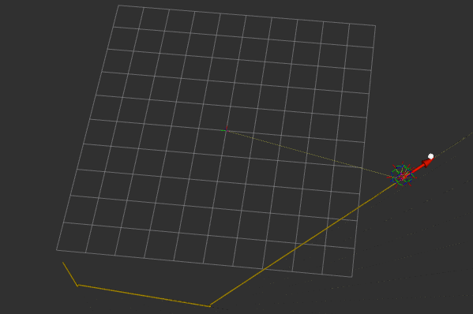
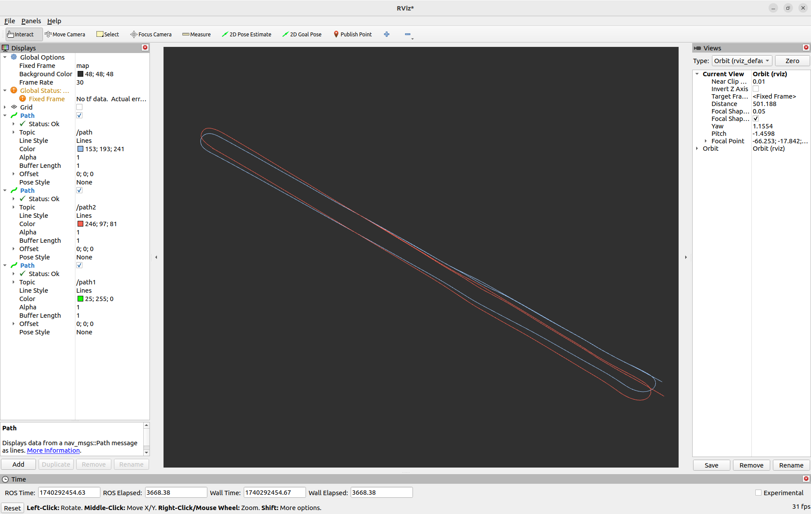
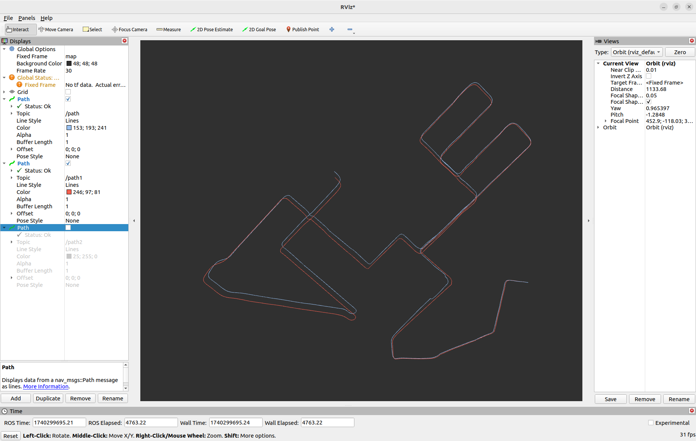

# AIIMU数据处理+ros2
## 任务说明：
1. 运行webots中的**epuck**机器人，发出需要的话题，包括IMU，位置信息（GPU/里程计）
2. **AIIMU**接收IMU数据，发出处理后的位置信息
3. **rviz**显示三条轨迹：原始IMU，原始位置信息，AIIMU处理后的数据

**注：webots_epuck中有一个属性是translation，可以表示位置，但好像没有发ros**
## 实现过程：
### 一、webots_epuck发出的IMU数据
- 数据格式(sensor_msgs/imu)：
```
std_msgs/Header header

geometry_msgs/Quaternion orientation
float64[9] orientation_covariance # Row major about x, y, z axes

geometry_msgs/Vector3 angular_velocity
float64[9] angular_velocity_covariance # Row major about x, y, z axes

geometry_msgs/Vector3 linear_acceleration
float64[9] linear_acceleration_covariance # Row major x, y z
```
- 添加IMU传感器：
    - 在epuck_webots.urdf加入
    ```
    <device reference="imu" type="InertialUnit">
        <ros>
            <topicName>/imu</topicName>
            <enabled>true</enabled>
            <alwaysOn>true</alwaysOn>
        </ros>
    </device>
    ```
    - 在epuck_world.wbt加入（E-puck节点下的turretSlot节点中加）
    ```
    InertialUnit {
      name "imu"
      resolution 0.001  # 设置分辨率，单位：m/s² 或 rad/s
      # 设置 IMU 的位置，以下坐标是相对于机器人主体的位置
      pose 0 0 0.1 0 0 0  # 设置位置（x, y, z）和方向（roll, pitch, yaw）

    }
    ```
- 还是没有接收到/imu话题

**暂时不考虑这个**

------------------------------  
### 二、rviz接收IMU数据绘制轨迹图
1. rviz根据里程计绘制轨迹图
    - 启动epuck，在rviz中更改
    - 结果展示：

2. rviz根据IMU数据绘制轨迹图
    - **由IMU生成路径path？？**
        - 考虑根据IMU数据给出的位置信息（在aiimu中找到相关代码）
        - 根据位置信息给出/path话题
        - rviz接收/path信息并绘制路径
3. location_path_rviz代码思路：
    - 根据真实位置信息，给出/path话题，rviz可以接收path信息绘制轨迹图
4. 发布path信息，并启动rviz
    - `ros2 run webots_demo location_path_rviz` 
    - `ros2 run rviz2 rviz2`
5. rviz接收path信息
    1. **添加 `Path` 显示**：
        - 在左侧面板中的 "Displays" 部分，点击 "Add" 按钮。
        - 选择 `Path` 类型，然后点击 "OK"。
        - 在 `Path` 显示中，设置路径话题为 `/path`
        - 确保 "Queue Size" 和其他设置符合需求。

    2. **配置坐标系**：
        - 在 `Global Options` 中，设置 "Fixed Frame" 为 `map`
        - 可以设置 "Background" 为透明，调整显示参数来优化视觉效果。

    3. **调整视图**：
        - 可以使用鼠标滚轮来缩放，右键拖动调整视角，左键单击来平移。
        - 确保在正确的视角下查看路径。
6. 结果：path为真实位置，path1为ai校准之后通过imu得到的位置信息，path2为原始imu得到的位置信息
- 20: 
- 28: 

------------------------------
### 三、AIIMU发出ros2话题，内容为模型处理后的imu数据
1. aiimu输入/输出数据格式：
```
mondict = {
            时间,真实位置 ,真实旋转角度 ,真实速度,
            IMU测量值（角速度和加速度）, 名字,开始时间
        }
```
2. 考虑使用其给出的位置信息就可以了
    - 将data数据集转为.txt格式，提取位置信息
    - 将运行结果给出的mondict输出到temp中，提取位置信息
    - 找到imu处理代码，给出imu直接推算的位置

-------------------------------
### 概念解释：
- translation x, y, z 通常是表示物体或机器人在三维空间中的位置
- rotation x, y, z：这三个值表示旋转轴的方向。它们通常是单位向量的坐标，用来定义旋转轴在三维空间中的方向。angle：这个值表示绕上述旋转轴旋转的角度，单位通常是弧度（rad）或度数（°）。角度值通常是正负值，表示顺时针或逆时针的旋转。

## 操作过程：
1. 启动webots中的epuck
    - 进入code/AIIMU_ros2/webots_epuck_ws工作空间
    - conda deactivate
    - colcon build(可选)
    - source /opt/ros/humble/setup.bash
    - source install/local_set.sh
    - ros2 launch webots_epuck my_launch.py rviz:=true
2. 查看webots中的epuck发出的IMU数据
    - ros2 topic list(查看是否有/imu话题)
    - ros2 topic echo --no-arr /imu


zotero读论文


