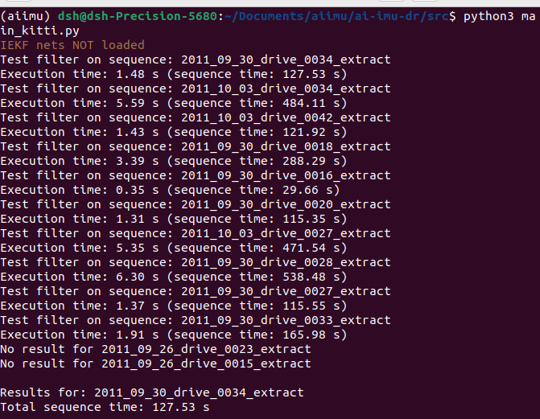

## 参考：https://github.com/mbrossar/ai-imu-dr?tab=readme-ov-file

### 创建conda环境
- `conda create -n aiimu python=3.5`
- `conda activate aiimu` 进入环境
### 安装 [Pytorch](https://pytorch.org/)
- 查看cuda版本`nvidia-smi`
    - 
    - cuda12.2
    - pytorch以往版本：https://pytorch.org/get-started/previous-versions/
    - conda，v2.1.0，CUDA 12.1命令：`conda install pytorch==2.1.0 torchvision==0.16.0 torchaudio==2.1.0 pytorch-cuda=12.1 -c pytorch -c nvidia`

- 不行，python3.5太老了，不好找对应的pytorch
    - 删除`conda env remove --name aiimu`
    - 重新创建`conda create -n aiimu python=3.10`
    - 安装`conda install pytorch==2.1.0 torchvision==0.16.0 torchaudio==2.1.0 pytorch-cuda=12.1 -c pytorch -c nvidia`
### 安装必要软件包
    - conda install matplotlib numpy termcolor scipy navpy

### 接着按教程
- 代码位置：documents/aiimu
遇到问题：
    - temp.zip数据集被删除
    - numpy版本问题，解决方法：conda install numpy=1.23

- 测试`python3 main_kitti.py`结果


### 测试过程说明
1. 创建iekf扩展卡尔曼滤波实例
2. 创建torch_iekf实例
3. 设置滤波参数(即协方差参数)
4. 加载数据
5. 设置学习到的协方差
6. 处理数据集：
    如果数据集不在**里程计基准**中则跳过
    结果获取到：t, ang_gt, p_gt, v_gt, u 
7. 运行iekf，结果得到新的
    mondict = {
            '时间': t, '旋转矩阵': Rot, '速度': v, '位置': p, '角速度偏差': b_omega, '加速度偏差': b_acc,
            '相机旋转矩阵': Rot_c_i, '相机位移': t_c_i,
            '测量协方差': measurements_covs,
        }
    保存新的.p文件`dataset.dump(mondict, args.path_results, dataset_name + "_filter.p")`
    添加：将mondict数据保存到temp文件夹下的.txt文件中


### 使用其他数据集
1. main_kitti.py参数设置：
    - read_data = 1（读取数据集）
    - path_data_base = 数据集路径
2. 数据集格式说明：
    - 数据集目录
        - 日期目录
            - 序列目录
                - 很多oxts数据文件（例如，2011_09_30_drive_0028_extract_oxts_data_000000.txt）
3. 数据处理：
    - KITTIDataset.load_oxts_packets_and_poses(oxts_files)
    - 提取结果：oxts=(packet, T_w_imu)
        - packet=（纬度，经度，高度，
        滚转角，俯仰角，偏航角，
        北向速度，东向速度，
        前向速度，左向速度，上向速度，
        加速度x，加速度y，加速度z，
        前向加速度，侧向加速度，垂直加速度，
        角速度x，角速度y，角速度z，
        前向角速度，侧向角速度，垂直角速度，
        位置精度，速度精度，
        导航状态，卫星数量，位置模式，速度模式，方向模式）【后五个为整数，其他为浮点数】
        - T_w_imu=（旋转矩阵R，位移向量t-原点origin）
    - 处理结果：
        ```
        mondict = {
            't': t, 'p_gt': p_gt, 'ang_gt'ang_gt, 'v_gt': v_gt,
            'u': u, 'name': date_dir2, 't0't0
        }
        mondict = {
            时间,真实位置 ,真实旋转角度 ,真实速度,
            IMU测量值（角速度和加速度）, 名字,开始时间
        }
        ```
    - 通过`KITTIDataset.dump(mondict, args.path_data_save, date_dir2)`保存到.p文件中


### Oxford Inertial Odometry Dataset_2.0数据集
- 数据集来源：http://deepio.cs.ox.ac.uk/ 填写表单获取`Oxford Inertial Odometry Dataset_2.0`数据集
- 数据集说明：

### 1. **地面真值文件 (vicon)**

`vicon` 文件包含 **地面真值** 数据，通常提供被跟踪物体（例如机器人、无人机等）的实际位置和姿态。这些数据通常用于评估定位或跟踪算法的性能。文件中的字段如下：

- **Time**：数据点的时间戳（通常为秒）。
- **Header**：可能包含附加的元数据或头部标识符。
- **translation.x, translation.y, translation.z**：这些值表示物体在三维空间中的 **位置**，分别是沿 X、Y 和 Z 轴的坐标（单位：米）。
- **rotation.x, rotation.y, rotation.z, rotation.w**：这四个值通常使用 **四元数** 表示物体的 **姿态**。四元数是一种紧凑且高效的表示旋转的方法，避免了万向节锁等问题。四个组件（x, y, z, w）定义物体在三维空间中的旋转。

### 2. **传感器文件 (imu)**

`imu` 文件包含 **IMU（惯性测量单元）** 收集的传感器数据，通常包括加速度计、陀螺仪和磁力计的数据。以下是每个字段的含义：

- **Time**：IMU 数据点的时间戳（通常为秒）。
- **attitude_roll, attitude_pitch, attitude_yaw (radians)**：这些表示物体的 **姿态角度**：
  - **roll**：绕前向 (x) 轴的旋转。
  - **pitch**：绕横向 (y) 轴的旋转。
  - **yaw**：绕垂直 (z) 轴的旋转。
  这些值通常以 **弧度** 为单位。
  
- **rotation_rate_x, rotation_rate_y, rotation_rate_z (radians/s)**：这些表示物体绕 x、y 和 z 轴的 **角速度**，单位是 **弧度每秒**。

- **gravity_x, gravity_y, gravity_z (G)**：这些表示物体沿 x、y 和 z 轴的 **重力加速度**，单位是 **G（重力加速度）**。1G = 9.81 m/s²。通常，这些值用于估算设备的倾斜角度。

- **user_acc_x, user_acc_y, user_acc_z (G)**：这些表示物体沿 x、y 和 z 轴的 **线性加速度**，单位是 **G**。这些数据通常来自 IMU 中的加速度计。

- **magnetic_field_x, magnetic_field_y, magnetic_field_z (microteslas)**：这些表示物体在 x、y 和 z 轴方向的 **磁场**，单位是 **微特斯拉 (µT)**。这些数据来自磁力计，用于估算相对于地球磁场的姿态。

