## AI-IMU航位推算法
### 摘要翻译：
在本文中，我们提出了一种仅基于惯性测量单元（IMU）的轮式车辆航位推算的精确方法。在智能车辆的背景下，基于IMU的鲁棒且精确的航位推算可能有助于关联成像传感器的数据，安全地通过障碍物导航，或在外部感知传感器故障的极端情况下实现安全紧急停止。该方法的关键组件是卡尔曼滤波器和使用深度神经网络动态调整滤波器的噪声参数。该方法在KITTI里程计数据集上进行了测试，我们仅基于IMU的航位推算惯性方法能够准确估计车辆的3D位置、速度和方向，并自校准IMU偏差。我们平均实现了1.10%的平移误差，并且该算法与使用LiDAR或立体视觉的顶级方法相媲美。我们在以下网址开源了我们的实现：

https://github.com/mbrossar/ai-imu-dr

### 关键词翻译：
- **定位**（localization）
- **深度学习**（deep learning）
- **不变扩展卡尔曼滤波器**（invariant extended Kalman filter）
- **KITTI数据集**（KITTI dataset）
- **惯性导航**（inertial navigation）
- **惯性测量单元**（inertial measurement unit）

---

### 核心内容总结：
本文提出了一种基于IMU的智能车辆航位推算方法，结合卡尔曼滤波和深度学习技术，能够高精度估计车辆的运动状态，并在KITTI数据集上表现出色。该方法在外部传感器失效时尤其有用，且开源了代码供研究使用。

### 翻译：

#### I. 引言

智能车辆需要知道它们在环境中的位置以及它们如何在该环境中移动。对车辆动态的准确估计可以验证来自成像传感器（如激光、超声波系统和摄像机）的信息，关联这些数据，并确保在道路上无论遇到什么情况都能安全行驶 [1]。此外，在由于严重遮挡、缺乏纹理或更一般的成像系统故障而必须执行紧急停止的极端情况下，车辆必须能够准确评估其动态运动。出于所有这些原因，惯性测量单元（IMU）成为智能车辆的关键组件 [2]。需要注意的是，全球导航卫星系统（GNSS）虽然可以提供全球位置估计，但在密集建筑区域或隧道中容易丢失相位跟踪，容易受到干扰，并且无法提供连续、准确和鲁棒的定位信息，正如著名的KITTI数据集中GPS中断所展示的那样 [3]，参见图1。

卡尔曼滤波器通常用于整合IMU的输出。当IMU安装在汽车上时，通常的做法是让卡尔曼滤波器结合有关轮式车辆动态特性的辅助信息，例如假设横向和向上的速度近似为零的伪测量。然而，滤波器对这些辅助信息的置信度是通过一个噪声协方差参数编码的，该参数难以手动设置，而且应该动态调整。

---

### 核心内容总结：
- 智能车辆需要精确的动态估计来确保安全和验证传感器数据。
- IMU是智能车辆的关键组件，尤其在GNSS信号不可靠时（如隧道或密集城区）。
- 卡尔曼滤波器用于整合IMU数据，但噪声协方差参数难以手动设置且需要动态调整。

### 翻译：

#### 自适应运动（例如，弯道中的侧滑比直线行驶时更大）。利用人工智能（AI）领域的最新工具，即深度神经网络，我们提出了一种方法，可以自动学习这些参数及其动态调整，以实现仅基于IMU的航位推算。我们的贡献和论文的组织结构如下：

- **在第二部分中，我们介绍了轮式车辆的状态空间模型以及关于汽车运动的简单假设；**
- **在第三部分C节中，我们实现了一种先进的卡尔曼滤波器 [4, 5]，该滤波器利用运动学假设，并以统计方式将其与IMU输出相结合。它能够准确估计汽车的位置、方向和速度，以及IMU偏差，并提供相关的不确定性（协方差）；**
- **在第四部分A节中，我们利用深度学习对卡尔曼滤波器的协方差噪声参数进行动态调整。该模块显著提高了滤波器的鲁棒性和准确性，详见第五部分D节；**
- **在第五部分中，我们在KITTI数据集 [3] 上展示了该方法的性能。我们仅基于IMU的方法能够生成准确的估计结果，并与顶级的LiDAR和立体相机方法 [6, 7] 相媲美；我们尚未发现其他基于IMU的航位推算方法能够达到类似的结果；**
- **该方法不仅限于轮式车辆的纯惯性航位推算。由于卡尔曼滤波器的多功能性，它可以轻松应用于铁路车辆 [8]，与GNSS结合使用，作为IMU自校准的基础，或在路径重建和地图匹配方法中用作速度计 [9]-[12]。**

---

### 图1说明：
在KITTI数据集的序列08（2011年9月30日，行驶#28）上的轨迹结果 [3]。所提出的方法（绿色）在整个序列（4.2公里，9分钟）中准确地跟踪了基准轨迹，而纯IMU积分（青色）则迅速偏离。两种方法仅使用IMU信号，并使用基准姿态和速度进行初始化。在该序列中发生的GPS中断期间，我们的解决方案仍然能够准确估计轨迹。

---

### 核心内容总结：
- 本文提出了一种基于深度学习的IMU航位推算方法，能够动态调整卡尔曼滤波器的噪声参数。
- 该方法在KITTI数据集上表现出色，与顶级LiDAR和立体相机方法竞争。
- 该方法不仅适用于轮式车辆，还可扩展至铁路车辆、GNSS结合应用等场景。

### 翻译：

#### A. 与先前文献的关系

自动驾驶车辆必须依靠其搭载的传感器套件进行鲁棒的自我定位，这些传感器通常包括里程计、IMU、雷达或LiDAR以及摄像头 [1, 2, 12]。基于惯性传感器、摄像头和/或LiDAR的同步定位与地图构建（SLAM）技术已经实现了鲁棒的实时定位系统，例如 [6, 7]。尽管基于这些传感器的高精度解决方案最近已经出现，但当成像系统遇到问题时，它们可能会漂移。

对于轮式车辆，考虑车辆约束和里程计测量已被证明可以增加定位系统的鲁棒性 [13, 14, 15, 16]。尽管这些系统相当成功，但它们持续处理大量数据，计算量大且能耗高。此外，自动驾驶车辆应并行运行其自身基于IMU的鲁棒定位算法，以执行诸如在其他传感器故障时紧急停止的操作，或作为图像数据关联和解释的辅助 [2]。

高精度的航空或军事惯性导航系统实现了非常小的定位误差，但对于消费级车辆来说成本过高。相比之下，低成本和中等成本的IMU存在诸如比例因子误差、轴不对准和随机游走噪声等问题，导致定位快速漂移 [17]。这使得基于IMU的定位即使在短时间内也不适用。

惯性导航系统长期以来一直利用来自IMU信号的虚拟和伪测量，例如广泛使用的零速度更新（ZUPT）[18]-[20]，作为协方差调整 [21]。与此同时，深度学习和更广泛的机器学习在惯性导航领域引起了广泛关注 [22, 23]。在 [22] 中，使用支持向量回归估计速度，而在 [23] 中，使用循环神经网络进行端到端的惯性导航。这些方法很有前景，但仅限于行人航位推算，因为它们通常考虑缓慢的水平平面运动，并且必须直接从一小段IMU测量序列中推断速度，而我们可以使用更长的序列。更一般的端到端学习方法是 [24]，它在卡尔曼滤波器中端到端地训练深度网络。尽管有前景，但该方法在立体里程计实验中获得了较大的平移误差（>30%）。

最后，[25] 使用深度学习来估计局部里程计算法的协方差，该算法被输入到全局优化过程中，而在 [26] 中，我们使用高斯过程来学习车轮编码器的误差。我们的会议论文 [20] 包含了一些初步的想法，尽管完全不涉及协方差调整：神经网络主要尝试检测何时执行ZUPT。

卡尔曼滤波器中噪声参数的动态调整在跟踪文献中是标准的 [27]，然而调整规则依赖于应用，并且通常是工程师手动“调整”的结果。最后，在 [28] 中，作者提出使用经典的机器学习技术来学习卡尔曼滤波器的静态噪声参数（无调整），并将其应用于IMU-GNSS融合问题。

---

### 核心内容总结：
- 自动驾驶车辆需要依赖多种传感器进行定位，但基于IMU的定位在低成本系统中存在漂移问题。
- 深度学习和机器学习在惯性导航中的应用逐渐增多，但现有方法多局限于行人航位推算。
- 本文提出的方法通过动态调整卡尔曼滤波器的噪声参数，显著提高了定位的鲁棒性和准确性。

### 翻译：

#### II. IMU 与问题建模
##### A. IMU 建模
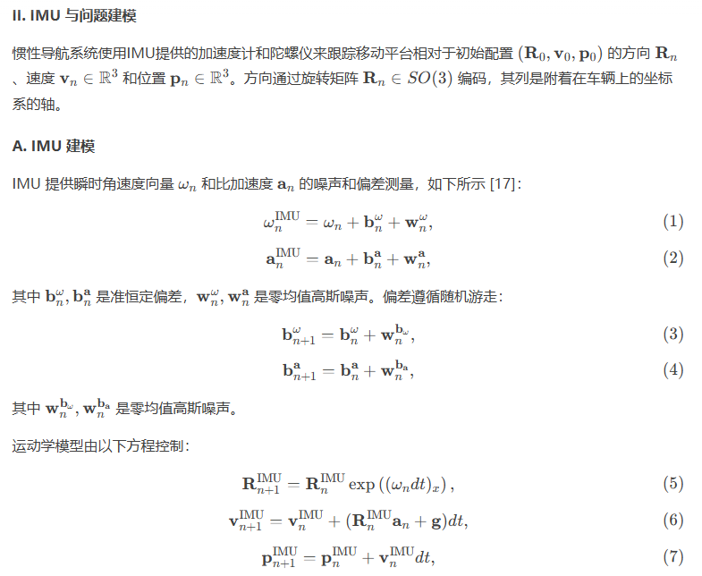
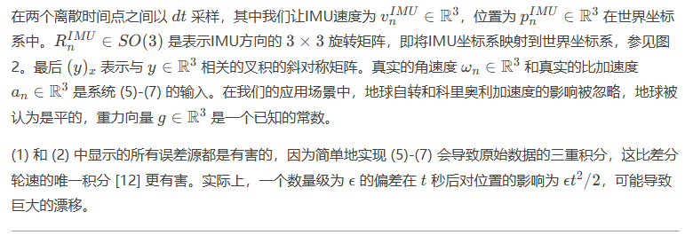
### 核心内容总结：
- IMU 提供带有噪声和偏差的角速度和加速度测量。
- 运动学模型通过旋转矩阵、速度和位置来描述IMU的运动。
- 偏差和噪声会导致位置估计的显著漂移，尤其是在长时间积分后。

### 翻译：

#### B. 问题建模
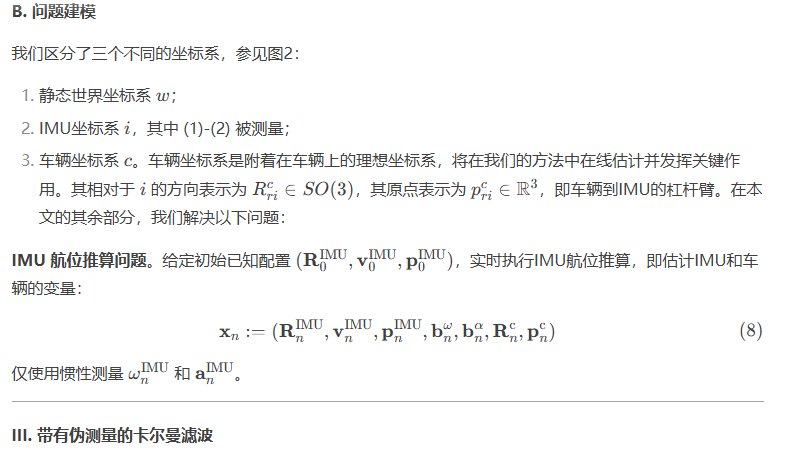
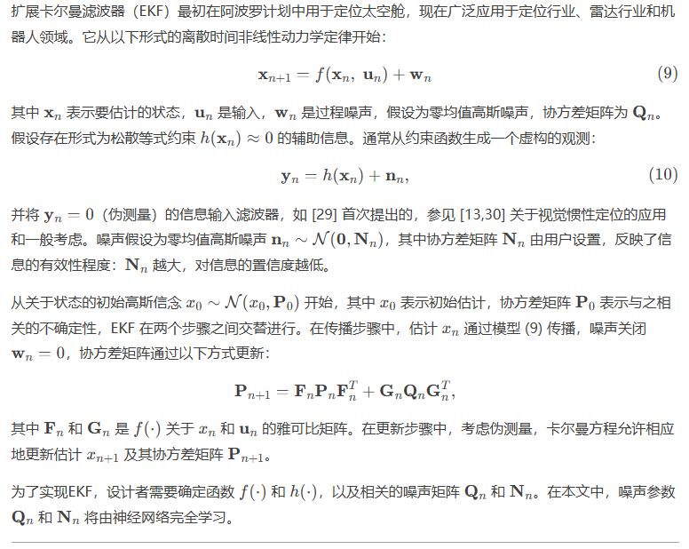

### 核心内容总结：
- 本文提出了基于IMU的航位推算问题，通过估计IMU和车辆的变量来实现实时定位。
- 扩展卡尔曼滤波器（EKF）用于处理非线性动力学模型，并通过伪测量进行状态更新。
- 噪声参数 \(\mathbf{Q}_{n}\) 和 \(\mathbf{N}_{n}\) 将由神经网络动态学习，以提高滤波器的鲁棒性和准确性。

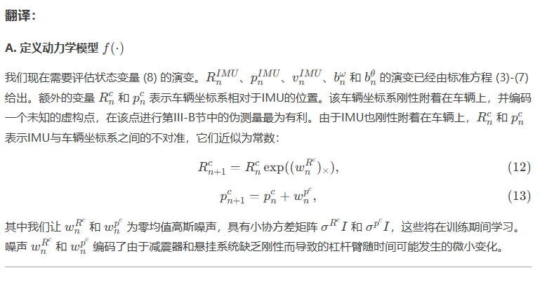
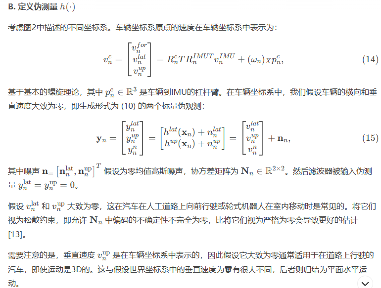
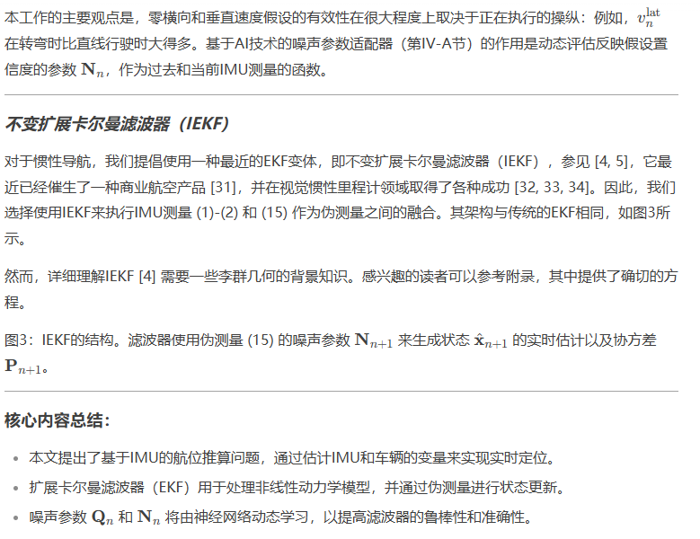

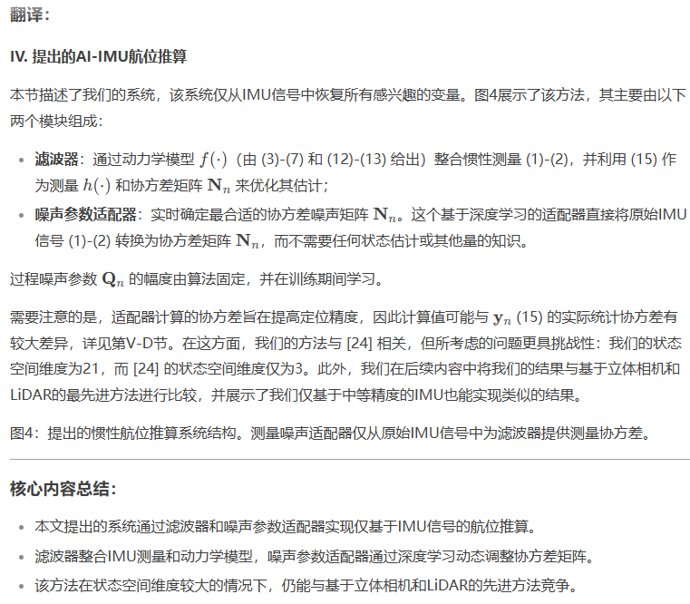

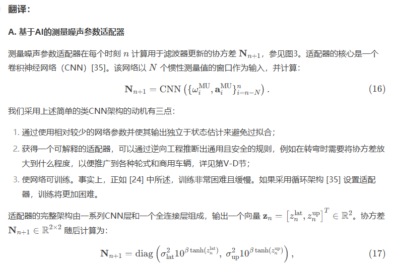
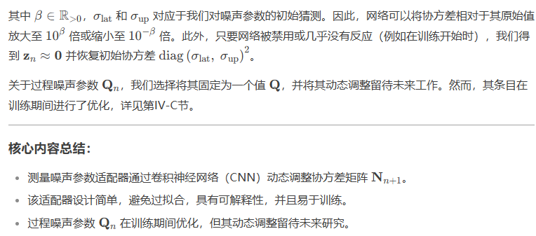

### 翻译：

#### B. 实现细节

本节提供了我们方法的设置和实现细节。我们使用Python和PyTorch库实现了整个方法，其中噪声参数适配器部分使用了PyTorch。我们在训练前设置了初始值：

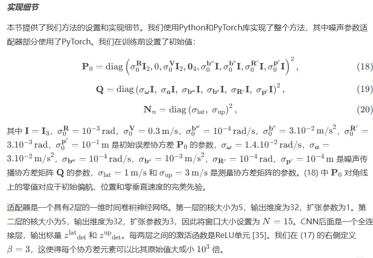

#### C. 训练
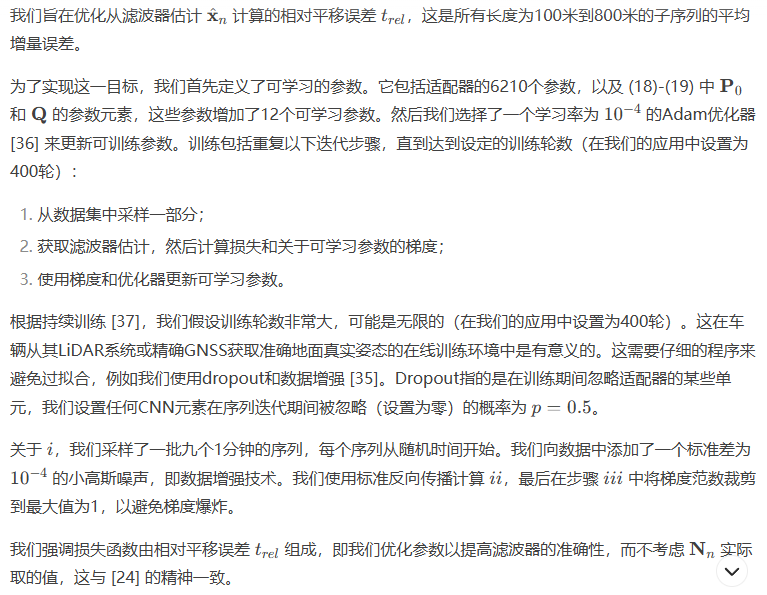

### 核心内容总结：
- 本文详细描述了基于IMU的航位推算方法的实现细节，包括初始参数设置和训练过程。
- 适配器使用一维卷积神经网络（CNN）动态调整噪声参数，训练过程通过Adam优化器优化相对平移误差。
- 训练过程中采用了数据增强和dropout技术，以避免过拟合并提高模型的泛化能力。

### 翻译：

#### V. 实验结果

我们在KITTI数据集 [3] 上评估了所提出的方法，该数据集包含从LiDAR、摄像头和IMU记录的数据，以及来自不同环境（如城市、高速公路和街道）的厘米级准确的地面真实姿态。该数据集包含22个用于基准测试的里程计算法序列，其中11个序列包含公开的地面真实轨迹、原始和同步的IMU数据。我们下载了以 \(100\,\mathrm{Hz}\)（\(dt=10^{-2}\,\mathrm{s}\)）采样的原始IMU信号数据，而不是以 \(10\,\mathrm{Hz}\) 采样的同步数据，并丢弃了序列 \(0.3\)，因为我们没有找到该序列的原始数据。RT30032 IMU的陀螺仪和加速度计偏差稳定性分别为 \(36\,\mathrm{deg}/\mathrm{h}\) 和 \(1\,\mathrm{mg}\)。KITTI数据集有一个在线基准测试系统，用于对算法进行排名。然而，我们无法将我们的算法提交到在线排名，因为用于排名的序列不包含IMU数据，这些数据仅用于训练。我们的实现已在以下网址开源：

https://github.com/mbrossar/ai-imu-dr.

---

### _评估指标和对比方法_

为了评估性能，我们考虑了 [3] 中提出的两个误差指标：

#### III-A1 相对平移误差 (\(t_{rel}\))

这是所有长度为 \(100\,\mathrm{m}\) 到 \(800\,\mathrm{m}\) 的子序列的平均相对平移增量误差，以行驶距离的百分比表示；

#### III-A2 相对旋转误差 (\(t_{rel}\))

这是所有长度为 \(100\,\mathrm{m}\) 到 \(800\,\mathrm{m}\) 的子序列的相对旋转增量误差，以每米度数表示。

我们比较了四种方法，这些方法分别使用LiDAR、立体视觉和基于IMU的估计：

* ***IMLS**[6]：一种最新的基于LiDAR的最先进方法，在KITTI基准测试中排名第3。作者在禁用闭环模块后向我们提供了代码；
* ***ORB-SLAM2**[7]：一个流行且多功能的库，用于单目、立体和RGB-D摄像头，计算地图的稀疏重建。我们采用了开源代码，禁用了闭环功能，并在不修改任何参数的情况下评估了立体算法；
* ***IMU**：基于 (4)-(5) 的直接IMU测量积分，即纯惯性导航；
* ***proposed**：所提出的方法，仅使用IMU信号，不涉及其他传感器。

---

### 核心内容总结：
- 本文在KITTI数据集上评估了所提出的基于IMU的航位推算方法，并与基于LiDAR和立体视觉的先进方法进行了比较。
- 评估指标包括相对平移误差和相对旋转误差，用于衡量算法的性能。
- 所提出的方法仅使用IMU信号，展示了其在无其他传感器辅助下的定位能力。

### 翻译：

#### V. 实验结果

我们在KITTI数据集 [3] 上评估了所提出的方法，该数据集包含从LiDAR、摄像头和IMU记录的数据，以及来自不同环境（如城市、高速公路和街道）的厘米级准确的地面真实姿态。该数据集包含22个用于基准测试的里程计算法序列，其中11个序列包含公开的地面真实轨迹、原始和同步的IMU数据。我们下载了以 \(100\,\mathrm{Hz}\)（\(dt=10^{-2}\,\mathrm{s}\)）采样的原始IMU信号数据，而不是以 \(10\,\mathrm{Hz}\) 采样的同步数据，并丢弃了序列 \(0.3\)，因为我们没有找到该序列的原始数据。RT30032 IMU的陀螺仪和加速度计偏差稳定性分别为 \(36\,\mathrm{deg}/\mathrm{h}\) 和 \(1\,\mathrm{mg}\)。KITTI数据集有一个在线基准测试系统，用于对算法进行排名。然而，我们无法将我们的算法提交到在线排名，因为用于排名的序列不包含IMU数据，这些数据仅用于训练。我们的实现已在以下网址开源：

https://github.com/mbrossar/ai-imu-dr.

---

### _评估指标和对比方法_

为了评估性能，我们考虑了 [3] 中提出的两个误差指标：

#### III-A1 相对平移误差 (\(t_{rel}\))

这是所有长度为 \(100\,\mathrm{m}\) 到 \(800\,\mathrm{m}\) 的子序列的平均相对平移增量误差，以行驶距离的百分比表示；

#### III-A2 相对旋转误差 (\(t_{rel}\))

这是所有长度为 \(100\,\mathrm{m}\) 到 \(800\,\mathrm{m}\) 的子序列的相对旋转增量误差，以每米度数表示。

我们比较了四种方法，这些方法分别使用LiDAR、立体视觉和基于IMU的估计：

* ***IMLS**[6]：一种最新的基于LiDAR的最先进方法，在KITTI基准测试中排名第3。作者在禁用闭环模块后向我们提供了代码；
* ***ORB-SLAM2**[7]：一个流行且多功能的库，用于单目、立体和RGB-D摄像头，计算地图的稀疏重建。我们采用了开源代码，禁用了闭环功能，并在不修改任何参数的情况下评估了立体算法；
* ***IMU**：基于 (4)-(5) 的直接IMU测量积分，即纯惯性导航；
* ***proposed**：所提出的方法，仅使用IMU信号，不涉及其他传感器。

---

### 核心内容总结：
- 本文在KITTI数据集上评估了所提出的基于IMU的航位推算方法，并与基于LiDAR和立体视觉的先进方法进行了比较。
- 评估指标包括相对平移误差和相对旋转误差，用于衡量算法的性能。
- 所提出的方法仅使用IMU信号，展示了其在无其他传感器辅助下的定位能力。

### 翻译：

#### B. 轨迹结果

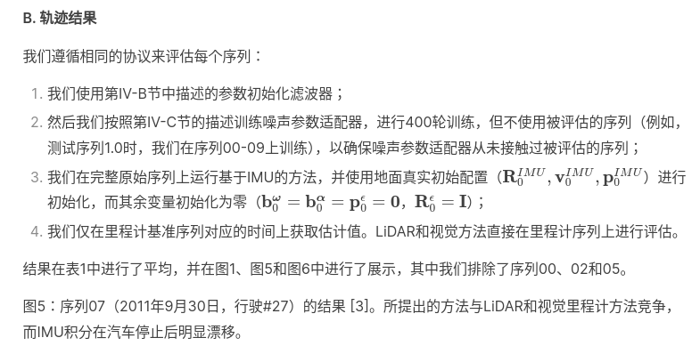
结果在表1中进行了平均，并在图1、图5和图6中进行了展示，其中我们排除了序列00、02和05。

图5：序列07（2011年9月30日，行驶#27）的结果 [3]。所提出的方法与LiDAR和视觉里程计方法竞争，而IMU积分在汽车停止后明显漂移。

表格 1. 来自 [3] 的结果。IMU 积分倾向于发生漂移或发散，而提出的方法可以作为 LiDAR 基于 (IMLS) 和立体视觉基于 (ORB-SLAM2) 方法的替代方案，仅使用 IMU 信息。事实上，平均而言，我们的航位推算解决方案比 ORB-SLAM2 的性能更好，并且其平移误差接近 LiDAR 基于方法 IMLS，IMLS 在 KITTI 在线基准测试系统中排名第三。序列 03 的数据无法用于算法测试，序列 00、02 和 05 在第 V-C 节中单独讨论。需要特别注意的是，IMLS、ORB-SLAM2 和提出的 AI-IMU 算法都使用了不同的传感器。基于不同信息对算法进行排名的问题具有争议。我们的目标是在这里更多地证明，仅使用一个中等精度的 IMU 数据，实际上可以达到与基于不同传感器的先进系统相似的结果，这一特性是相当令人惊讶的。

图 8. 适配器在高速公路序列 01（驾驶 #42, 2011/10/30）[3] 上计算的协方差值。我们可以明显观察到，当汽车在 t = 90 秒到 t = 110 秒之间转弯时，协方差值大幅增加。

这些结果表明：

- LiDAR和视觉方法在所有序列中通常表现良好，LiDAR方法的结果略优于视觉方法；
- 我们的方法在平均上与基于图像的方法竞争，参见表1；
- 直接积分IMU信号会导致估计值快速漂移，尤其是在最长的序列中，甚至在短时间内也是如此；
- 我们的方法似乎不受汽车停止的影响，如序列07所示，参见图5。

这些结果非常显著，因为我们没有使用任何视觉传感器或车轮里程计。我们仅使用了IMU，而且IMU的精度适中。

我们还试图将我们的方法与视觉惯性里程计算法进行比较。然而，我们找不到在完整KITTI数据集上表现良好的开源方法。我们测试了 [38]，但代码仍在开发中（结果有时会发散），而 [39] 的作者评估了他们的非开源方法，仅适用于短序列（\(\leq\) 30秒）。论文 [33, 40] 在序列08上评估了他们的视觉惯性里程计方法，最终误差约为20米，是我们方法的四倍，而我们的方法最终与地面真实的距离仅为5米。这清楚地表明，为地面车辆量身定制的方法 [13, 15] 可能比为智能手机、无人机和航空器设计的通用方法具有更高的准确性和鲁棒性。

---

### 核心内容总结：
- 本文提出的基于IMU的方法在KITTI数据集上表现出色，与LiDAR和视觉里程计方法竞争。
- 直接积分IMU信号会导致快速漂移，而所提出的方法在汽车停止时仍能保持稳定。
- 与视觉惯性里程计方法相比，所提出的方法在长序列上表现更优，展示了其在无视觉传感器辅助下的强大定位能力。

### 翻译：

#### _序列00、02和05的结果_

根据第V-B节描述的程序，所提出的方法在序列00、02和05上的表现似乎有所下降，参见图9。然而，这种行为完全可以解释：由于IMU和地面真实数据的记录问题，数据在几秒钟内缺失。这在图10中序列02的示例中得到了说明，我们绘制了随时间变化的可用数据。我们观察到IMU和地面真实信号的跳跃，说明在 \(t=1\) 和 \(t=3\) 之间数据缺失。在第V节描述的训练阶段中，使用这些序列时手动纠正了这个问题。

尽管由于记录问题，这些序列本可以被丢弃，但我们在测试中使用它们时没有纠正这些问题。这自然导致了性能下降，但也证明了我们的方法对此类问题具有显著的鲁棒性，尽管这些问题本身具有固有的危害性。例如，序列02的2秒时间跳跃导致了估计偏移，但没有发生发散，参见图9。

---

#### _讨论_

性能归功于三个组成部分：  
1) 使用了一种已被证明非常适合基于IMU定位的最新IEKF；  
2) 通过神经网络学习的动态噪声参数调整，将辅助信息以伪测量的形式纳入；  
3) 考虑了IMU坐标系与车辆坐标系之间的“松散”不对准。

关于第1点，应该强调的是，该方法非常适合使用传统的EKF，并且可以根据需要轻松调整。然而，我们提倡使用IEKF，因为它的准确性和收敛性。为了说明第2点和第3点的好处，我们考虑了所提出算法的两个子版本。

一个版本没有对准，即 \(\mathbf{R}_{n}^{c}\) 和 \(\mathbf{p}_{n}^{c}\) 不包含在状态中，并固定为其初始值 \(\mathbf{R}_{n}^{c}=\mathbf{I}\)，\(\mathbf{p}_{n}^{c}=0\)；另一个版本使用静态滤波器参数 (18)-(20)。

高速公路序列01的最终轨迹结果绘制在图7中，我们看到这两个子版本方法在车辆转弯时遇到了问题。因此，它们的相对平移误差 \(t_{rel}\) 高于所提出方法的完整版本：所提出方法实现了1.11%，没有对准杠杆臂的方法实现了1.65%，而没有协方差调整的方法则产生了1.94%的误差。所有方法的旋转误差 \(r_{rel}=0.12\deg/m\) 相同。这可以预期，因为所考虑的序列中，完整方法与标准IMU积分方法具有相同的旋转误差。

---

#### _结论_

本文提出了一种用于轮式车辆惯性航位推算的新方法。我们的方法利用深度神经网络动态调整关于车辆运动的简单假设的协方差，这些假设在不变扩展卡尔曼滤波器中用于执行定位、速度和传感器偏差估计。整个算法仅使用IMU信号，不需要其他传感器。该方法产生了令人惊讶的准确结果，并开辟了新的前景。在未来的工作中，我们希望解决图像卡尔曼协方差矩阵的学习问题，以及从一个车辆到另一个车辆的泛化问题。

---

#### _致谢_

作者感谢J-E. Deschaud分享了IMLS算法 [6] 的结果，并感谢Paul Chauchat进行了相关讨论。

---

### 核心内容总结：
- 本文提出的方法在KITTI数据集上展示了鲁棒性，即使在数据缺失的情况下也能保持稳定。
- 通过动态调整协方差和考虑IMU与车辆坐标系的不对准，显著提高了定位精度。
- 未来的研究方向包括图像协方差矩阵的学习和跨车辆的泛化能力。