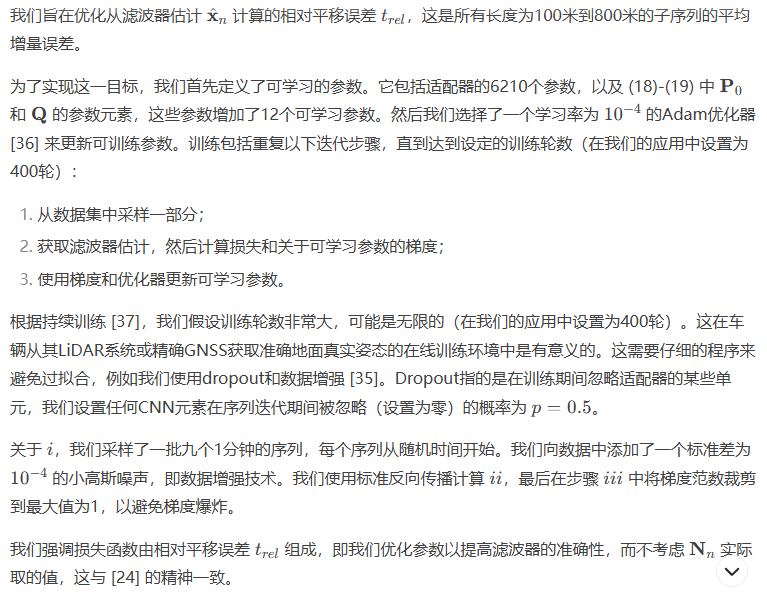

- 全部状态参数（由IMU的原始参数角速度和比加速度产生）：

- 全局坐标系，IMU坐标系，车辆坐标系转换：

- 
- 
- 
- 
- 神经网络为CNN：适配器由多个CNN层和一个全连接层组成

## 实验情况
### 数据集
- 使用KITTI数据集
    - 包含通过LiDAR、摄像头和IMU记录的数据，以及不同环境（如城市、高速公路和街道）下厘米级精度的**真值姿态**
    - 包含22个**序列**，用于基准测量里程计计算
        - 11个序列包含公开的**真值轨迹**、原始数据、时间同步的IMU数据（采样频率为10Hz）
- 使用IMU信号采样率为100Hz（dt=10-2s）的原始数据，并排除序列03
- RT30032 IMU的陀螺仪和加速度计**偏置稳定性**分别为36deg/h和1mg
----------------
名词解释：
- 序列：KITTI数据集中的序列是指从特定环境或驾驶场景中的记录**数据集合**
- 真值姿态：指在任何给定时间的真实位置和方向（例如，GPS）
- 真值轨迹：车辆或传感器随时间遵循的完整路径或轨迹
- 偏置稳定：对于IMUS，陀螺仪和加速度计偏置稳定性表明偏差会随着时间的流逝而漂移多少。较低的值意味着传感器的偏差在长期内更稳定和可靠
- IMU原始数据情况：加速度和角速度的测量值
----------------
### 评估指标
1. **相对平移误差 (Relative Translation Error)**：  
   这个指标用来衡量在一段行驶距离（例如 100m 到 800m）内，估计的平移（位置）增量与实际平移增量之间的误差。具体来说，它计算的是每个子序列的平移误差与实际行驶距离的百分比。  
  
   **意思**：它描述的是位置估计的相对误差。例如，如果车辆行驶 100 米，且估计的平移误差为 2 米，那么相对平移误差为 2%。

2. **相对旋转误差 (Relative Rotation Error)**：  
   这个指标衡量的是在一段行驶距离内，估计的旋转增量（角度变化）与实际旋转增量之间的误差。通常，它以每米的度数来表示，表示每行驶一米时旋转误差的大小。  

   **意思**：它描述的是旋转误差在行驶过程中的变化。例如，如果车辆行驶 100 米，估计的旋转误差为 3 度，那么每米的旋转误差为 0.03 度/米。

总的来说：
- **相对平移误差**：关注位移精度，即估计的位置与真实位置之间的差异。
- **相对旋转误差**：关注姿态精度，即估计的方向（旋转）与真实方向之间的差异。

这两个误差指标结合起来可以全面评价位姿估计算法的性能。
### 结果分析
比较了四种方法，这些方法分别使用LiDAR、立体视觉和基于IMU的估计：

1. **IMLS**：一种最新的基于LiDAR的最先进方法，在KITTI基准测试中排名第3。其作者在禁用闭环模块后向我们提供了代码；
2. **ORB-SLAM2**：一个流行且多功能的库，用于单目、立体和RGB-D摄像头，计算地图的稀疏重建。我们采用了开源代码，禁用了闭环功能，并在不修改任何参数的情况下评估了立体算法；
3. **IMU**：基于 (4)-(5) 的直接IMU测量积分，即纯惯性导航；
4. **proposed**：所提出的方法，仅使用IMU信号，不涉及其他传感器。

- 表1：

- 序列07,轨迹结果：

- 适配器在高速公路序列01上计算的协方差值。我们可以明显观察到，当汽车在 t = 90 秒到 t = 110 秒之间转弯时，协方差值大幅增加。

## 实现细节

### 训练

### 轨迹结果获取规则
