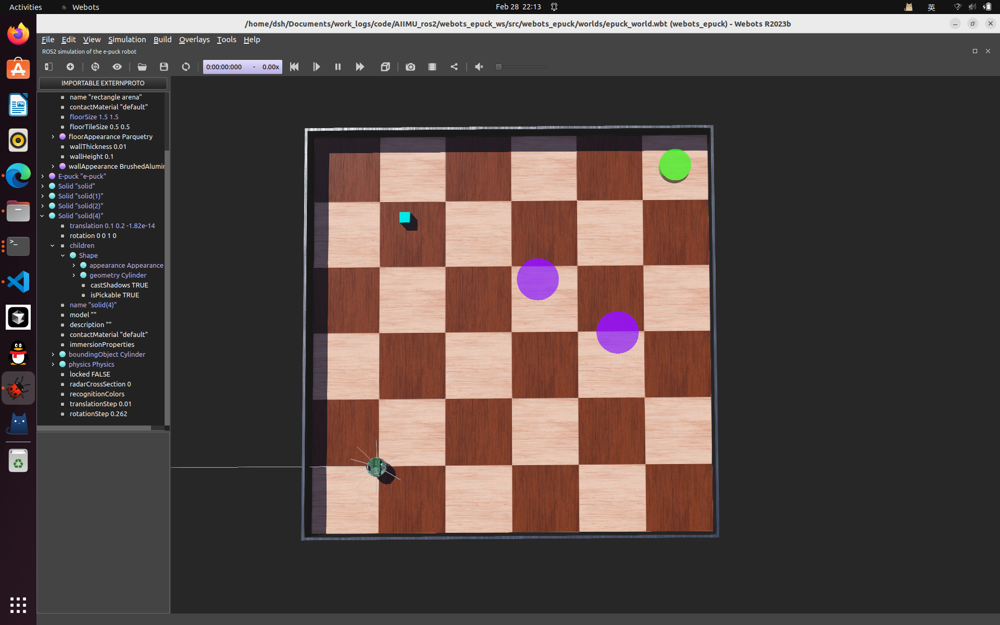

#### 1. 制作webots场景
    - 修改code/AIIMU_ros2/webots_epuck_ws/src/epuck_world.wbt

#### 2. 在rviz中显示场景
- ros2 launch webots_epuck my_launch.py rviz:=true nav:=true
- ros2 run rviz2 rviz2 
- ros2 launch webots_ros2_epuck robot_launch.py rviz:=true nav:=true

- 绘制地图：ros2 launch webots_epuck rats_life_waypoints_launch.py use_sim_time:=true
#### 3. 在rviz中显示轨迹

#### 实现过程
1. 制作webots场景：epuck_world.wbt
2. 在rviz中绘制地图并发出/map话题：`ros2 launch webots_epuck rats_life_waypoints_launch.py use_sim_time:=true`
3. 再启动一个rviz接收/map画出地图`ros2 run rviz2 rviz2`
4. 在rviz接收/path在地图上画轨迹`ros2 run ros2 run webots_demo location_path_rviz`
5. 在rviz接收/path1在地图上画轨迹`ros2 run ros2 run webots_demo location_path_rviz1`

# 出图:

#### 问题
- 问题1：小球穿过地面
    - 解决方法：没有设置好碰撞范围，设置boundingObject
    
- 问题2：建图不完全
    - 解决方法：启动其他控制器使epuck运动，如random_walk，