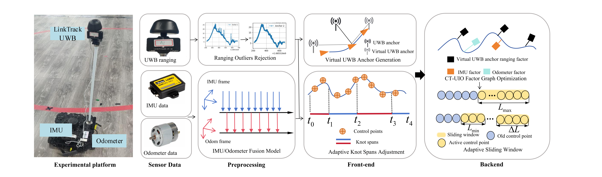

<p align="center">

  <h1 align="center">CT-UIO: Continuous-Time UWB-Inertial-Odometer Localization Using Non-Uniform B-spline with Fewer Anchors</h1>
  <p align="center">
    <a href="https://scholar.google.com/citations?hl=zh-CN&user=6J5iBzIAAAAJ"><strong>Jian Sun</strong></a>
    ·
    <a href=""><strong>Wei Sun</strong></a>
    ·
    <a href=""><strong> Genwei Zhang</strong></a>
    ·
    <a href="https://scholar.google.com/citations?hl=zh-CN&user=pKFqWhgAAAAJ"><strong>Kailun Yang</strong></a>
    ·
    <a href=""><strong> Song Li</strong></a>
    ·
    <a href=""><strong>Xiangqi Meng</strong></a>
    ·
    <a href=""><strong>Na Deng </strong></a>
    ·
    <a href=""><strong>Chongbin Tan</strong></a>
</p>
<p align="center">
    <a href="https://arxiv.org/pdf/2502.06287">
      
    </a>
</p>
<h2 align="center"></h2>
  <div align="center">
    
  </div>
Ultra-wideband (UWB) based positioning with fewer anchors has attracted significant research interest in recent years, especially under energy-constrained conditions. However, most existing methods rely on discrete-time representations and smoothness priors to infer a robot’s motion states, which often struggle with ensuring multi-sensor data synchronization. In this paper, we present an efficient UWB-Inertial-odometer localization system, utilizing a non-uniform B-spline framework with fewer anchors. Unlike traditional uniform B-spline-based continuous-time methods, we introduce an adaptive knot-span adjustment strategy for non-uniform continuous-time trajectory representation. This is accomplished by adjusting control points dynamically based on movement speed. To enable efficient fusion of IMU and odometer data,  we propose an improved Extended Kalman Filter (EKF) with innovation-based adaptive estimation to provide short-term accurate motion prior. Furthermore, to address the challenge of achieving a fully observable UWB localization system under few-anchor conditions, the Virtual Anchor (VA) generation method based on multiple hypotheses is proposed. At the backend, we propose a CT-UIO factor graph with an adaptive sliding window for global trajectory estimation. Comprehensive experiments conducted on corridor and exhibition hall datasets validate the proposed system's high precision and robust performance. 

# Qualitative Results
.gif)  
https://youtu.be/fxOcCRTWtT8

# TODO
- [ ] Release the code.
- [x] Release the [arxiv preprint](https://arxiv.org/pdf/2502.06287).
- [x] Release the dataset.
<br>

# Citation
If our work is helpful to you, please consider citing us by using the following BibTeX entry:
```
@article{Sun2025TITS,
      title={CT-UIO: Continuous-Time UWB-Inertial-Odometer Localization Using Non-Uniform B-spline with Fewer Anchors}, 
      author={Jian Sun and Wei Sun and Genwei Zhang and Kailun Yang and Song Li and Xiangqi Meng and Na Deng and Chongbin Tan},
      journal={arXiv preprint arXiv:2502.06287},
      year={2025}
}
```
