## CT-UIO：使用非均匀 B 样条和较少锚点进行连续时间 UWB 惯性里程计定位

### 摘要
超宽带（UWB）定位技术，在锚点数量较少的情况下，近年来吸引了大量研究兴趣，尤其是在能源受限条件下。然而，大多数现有方法依赖于离散时间表示和光滑性先验来推断机器人的运动状态，这通常难以确保多传感器数据同步。在本文中，我们提出了一种高效的 UWB-Inertial-odometer 定位系统，利用具有较少锚点的非均匀 B 样条框架。与传统基于均匀 B 样条的连续时间方法不同，我们引入了一种自适应节点跨度调整策略，用于非均匀连续时间轨迹表示。这是通过根据移动速度动态调整控制点来实现的。为了实现 IMU 和里程计数据的有效融合，我们提出了一种改进的扩展卡尔曼滤波器（EKF），具有基于创新的自适应估计，以提供短期准确的运动先验。此外，为了解决在少数锚点条件下实现完全可观测的 UWB 定位系统的挑战，提出了基于多个假设的虚拟锚点（VA）生成方法。 在后台，我们提出了一种具有自适应滑动窗口的 CT-UIO 因子图，用于全局轨迹估计。在走廊和展览厅数据集上进行的综合实验验证了所提出系统的高精度和鲁棒性能。本工作的代码库和数据集将在https://github.com/JasonSun623/CT-UIO上开源。

索引词 - 超宽带惯性里程计，融合，连续时间轨迹，因子图，少量锚点

### 1.简介
基于位置的服务[1]-[4]，如轨迹预测、物体跟踪和自动拣选操作，已成为机器人研究的重要组成部分。全球导航卫星系统（GNSS）在户外晴朗天空环境中可以达到米级精度。然而，可靠的
GNSS 室内定位不切实际，因为 GNSS 信号衰减。为了在无 GPS 环境中实现稳健的室内定位服务，超宽带（UWB）技术被视为一种有希望的替代解决方案，它受益于其稳定性、低成本和在大规模部署中的可扩展性[5]，[6]。基于 UWB 信号测距，大多数当前的基于测距的定位方案至少需要三个锚点来确定移动目标的 2D 位置，这通常也被称为三角测量[7]，[8]。然而，在能量受限的 UWB 网络或空间受限的部署场景中，如狭窄走廊或隧道，可能只有一或两个锚点可用。这种限制使得传统的三角测量定位方法在这种环境中无效。
在这种情况下，基于少量锚点的范围定位具有挑战性，并已成为一个有吸引力的研究方向。现有方法[2]、[9]、[10]通常需要特殊的锚点天线阵列或集成额外的传感器，如惯性测量单元（IMU）、轮式里程计和相机，以提供补充的速度或角度测量。IMU 和里程计与环境无关，并提供即时的响应速度，使得可以在连续的 UWB 测距测量之间构建相对位置约束。传统的传感器融合方案[2]、[11]、[12]如扩展卡尔曼滤波器（EKF）和粒子滤波器（PF），通常依赖于平滑先验来推断机器人的运动状态。然而，这些方法基于离散时间（DT）轨迹估计，可能无法充分表示平滑性。用于推断机器人运动状态的插值方案可能不准确。此外，多模态传感器配置通常涉及来自不同传感器的异步测量，这在估计过程中的同一时间点融合数据时造成困难。
近年来，连续时间表示在多传感器标定、运动规划和目标跟踪中得到越来越广泛的应用[13]-[16]。连续时间公式的关键优势在于其能够生成具有连续数据流的平滑轨迹。特别是，B 样条线通过一组控制点定义时间多项式(temporal polynomials)，表示轨迹，从而实现在任意时刻进行局部性姿势查询。大多数现有方法[17][19]采用基于 B 样条的均匀策略进行连续时间轨迹平滑更新，其中控制点均匀分布且通常是预先确定的。然而，这些方法通常依赖于恒定速度的假设
模型，对于许多实际应用来说不合适。由于机器人的速度不断变化，较小的控制点间距可能会导致过拟合和计算复杂度增加，而较大的间距会降低整体精度。得益于动态控制点分布，非均匀 B 样条正成为一种有吸引力的替代方案。Lang 等人[14]和 Dubé等人[20]的相关工作表明，非均匀结点采样策略可以更有效地适应轨迹复杂性。这些方法还证明，在轨迹估计精度和时间性能方面，非均匀采样策略可以优于均匀策略。
然而，对非均匀 B 样条方法的研究主要集中在激光雷达[14]和相机[21]在 SLAM 中的应用，尚未应用于少数锚点 UWB 定位。此外，现有的确定适当节点间距的非均匀策略通常仅依赖于 IMU 测量的速度估计，这些估计容易受到噪声的影响，导致不准确的间距间隔划分。
在这项工作中，我们提出了 CT-UIO，一种使用非均匀 B 样条和少量锚点的连续时间超宽带-惯性-里程计系统。CT-UIO 根据运动轨迹的变化动态调整控制点间距。一般来说，尽管连续时间方法已被广泛研究，但大多数现有工作依赖于均匀 B 样条来实现连续时间表示和估计。据作者所知，本文是首次利用非均匀连续时间表示进行 UWB/IMU/里程计融合定位，通过大量实验，我们可以在少量锚点场景或快速运动中实现高效的姿态估计。
本文的贡献总结如下。
我们提出了一种采用自适应结点跨度调整策略的非均匀连续时间轨迹表示的连续时间超宽带-惯性里程计（CT-UIO）定位系统。CT-UIO 融合了时间不同步的超宽带测距、IMU 和里程计数据，即使在少数锚点场景和时间变化的运动中也能实现准确的姿态估计。
我们使用基于创新的自适应估计的改进扩展卡尔曼滤波器（EKF）构建了一个 IMU/里程计融合模型，提供短期准确的运动先验。利用这一点，自适应结点间距调整策略根据运动速度动态调整控制点的数量。
我们通过结合 UWB 测距和来自 IMU/里程计融合模型的运动先验，在少量锚点条件下构建了一个完全可观测的 UWB 定位系统，并通过基于多个假设的虚拟锚点部署方案来避免共线。
CT-UIO 系统在多个真实世界数据集上进行了评估，包括与最先进方法的比较。大量的实验结果表明，该系统在处理快速运动方面具有优越性。为了造福社区，相关的数据集和源代码已在https://github.com/ JasonSun623/CT-UIO 公开提供。

### 2.相关工作
A. 少锚点 UWB 定位

少数锚点 UWB 定位最近越来越受到关注，并因其低复杂度和成本效益的部署而得到广泛研究[9]，[10]，[22]。这些研究工作主要关注将 UWB 测量与其他运动传感器融合的融合方案。主流工作主要采用基于滤波器、基于优化和两阶段方法来融合额外的速度观测。在基于滤波器的解决方案中，Cao 等人[23]使用扩展卡尔曼滤波（EKF）将单个 UWB 锚点与九自由度 IMU 结合用于速度和姿态估计。Qin 等人[24]设计了一种基于约束区间的集合成员滤波（SMF）方法，用于单信标定位问题。Gao 等人[22]将 UWB 测距、来自载体的非完整约束和轨迹约束作为 EKF 系统的观测。提出的方法可以在走廊状区域内实现定位。然而，它依赖于非完整和走廊特定的轨迹约束，这些约束可能不适用于未知的环境结构。在基于优化的解决方案中，Li 等人 [25] 提出了一种移动时域估计（MHE）算法，该算法利用单个 UWB 锚点和 IMU 在时间范围内的历史测量数据。此外，还进一步提出了一种梯度感知 Levenberg-Marquardt（GALM）算法来解决具有计算成本的优化问题。对于两阶段方法，杨等人[26]提出了一种改进的定位方法，该方法利用贝叶斯优化根据误差模型提供估计的 IMU 数据。然后，一个滤波器使用先验位置误差在测距时间更新位置。周等人[27]提出了一种两阶段优化方法，该方法可以产生单锚点和里程计的准确解。在第一阶段，他们构建了一个因子图，该图结合了里程计位置和 UWB 测量值以优化状态估计。在第二阶段，执行自适应信任域算法以细化位置估计并保持与不等式约束的鲁棒性。虽然这些方法近似了状态估计和传感器测量之间的时间偏移，但在实际场景中，时间同步的假设可能并不总是成立。 与现有的少数锚点 UWB 定位方法不同，我们的方法使用 B 样条将轨迹公式化为连续时间，这允许在任何轨迹时间点对异步、高频传感器测量进行对齐，而不是仅在测量时间依赖离散时间姿态的线性插值。

B. 使用 B 样条表示连续时间
连续时间表示是制定轨迹和确保平滑性的流行且自然的选择。它可以估计机器人的姿态作为时间的连续函数，无需在每次测量时间引入额外的状态。最常见的基于连续时间的模型是基于样条和高斯过程[15]。在本文中，我们专注于基于 B 样条的轨迹表示，
图 1. CT-UIO 框架：在预处理阶段，检测 UWB 测距数据并去除异常值。同时，使用自适应 EKF 融合 IMU 和里程计数据，以提供短期准确的运动先验。在前端，将 IMU/里程计融合模型的结果与 UWB 测距相结合，生成虚拟锚点。此外，基于 IMU/里程计融合模型的运动估计，自适应结点跨度调整策略非均匀地放置控制点。在后端，我们使用自适应滑动窗口进行全局轨迹估计的 CT-UIO 因子图。
当前文献越来越关注在多传感器融合系统中应用 B 样条进行连续时间状态估计，包括激光雷达-惯性系统、视觉-惯性系统、超宽带-惯性系统等。Nguyen 等人[16]开发了一种实时连续时间激光雷达-惯性里程计（SLICT2），使用简单的求解器实现了高效的优化，迭代次数很少。Lu 等人[28]提出了一种基于事件的视觉-惯性速度计，逐步结合了立体事件相机和 IMU 的测量。Li 等人[17]提出了一种基于样条的方法（SFUISE）用于连续时间超宽带-惯性传感器融合，解决了异步多传感器融合和在线校准中离散时间传感器融合方案的局限性。这些方法通常采用均匀节点 B 样条进行轨迹建模，依赖于零速度或恒定速度的假设。然而，这些假设往往无法捕捉到现实运动的真实动态性质。非均匀 B 样条提供了更灵活的控制点分布，可以根据轨迹段的平滑度实现不同密度的控制点。 Ovrén 等人[29]在样条拟合中引入了一个能量比例指数，以优化节点间距的选择。通过利用样条基函数的不同频率响应特性和特定的能量值，可以自动选择合适的节点间距。Lang 等人[14]使用非均匀 B 样条曲线紧密耦合了激光雷达、IMU 和相机的测量数据。他们根据 IMU 观测自适应地调整控制点的数量，以检测不同的运动模式，从而提高对复杂环境和运动模式的适应性。然而，仅依赖 IMU 数据会导致速度估计发散，这会影响控制点的分布，最终降低定位精度。相比之下，提出的方法集成了 IMU/里程计融合模型，以提供短期准确的速率估计，从而能够动态调整控制点密度，以实现更精确的轨迹建模。

### 3.系统概述
图 1 显示了我们的 CT-UIO 概述。最初，我们假设 UWB-Inertial-Odometer 系统已校准，IMU 偏置和里程计比例已初始化。在预处理中，我们应用不等式约束以去除 UWB 测距异常值并建立 IMU/里程计融合模型（第 III-A 节）。接下来，我们提出了一种非均匀连续时间状态估计方法，使用自适应节点跨度调整策略来紧密融合来自 UWB 测距、IMU 和里程计的高频测量（第 III-B 节）。为了使少数锚点 UWB 定位系统完全可观测，我们将 UWB 测距测量与 IMU/里程计融合模型中的短期位置估计相结合，以生成虚拟 UWB 锚点（第 III-C 节）。在后端，我们使用自适应滑动窗口进行 UWB-Inertial-Odometer 因子图联合优化，以获得最佳估计（第 III-D 节）。对于 UWB/IMU/里程计集成（UIO）系统，我们用 
 表示 UWB 框架， 
 表示 IMU 框架， 
 表示轮式里程计框架， 
 表示世界坐标系框架。

 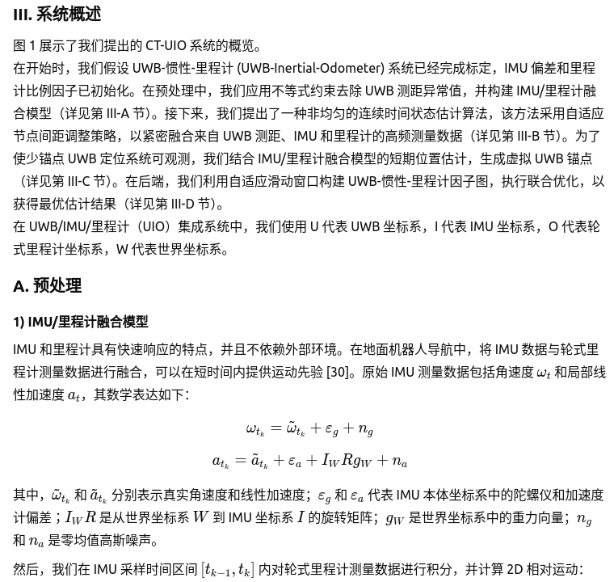
 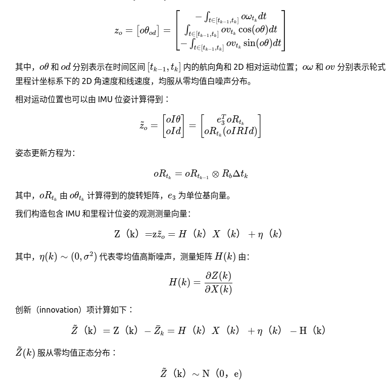
 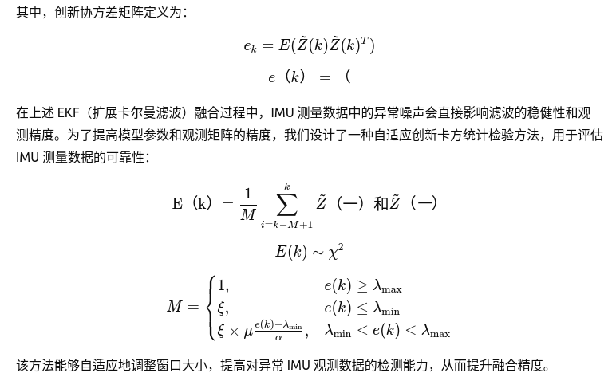
 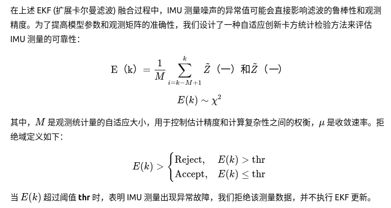
 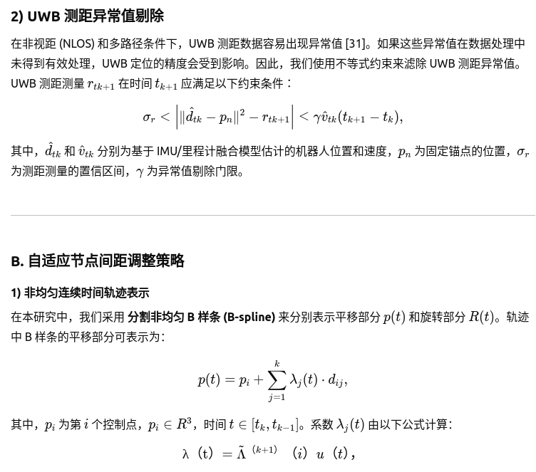
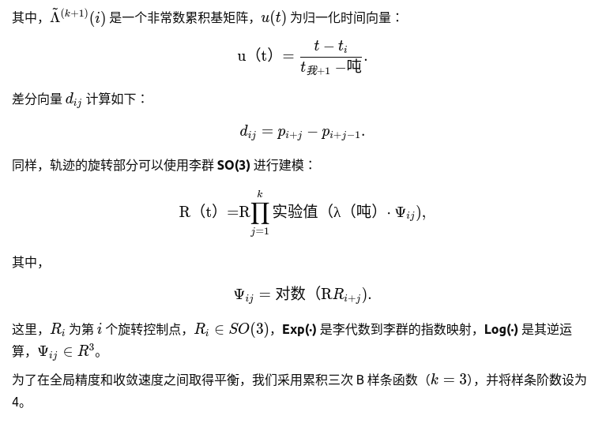
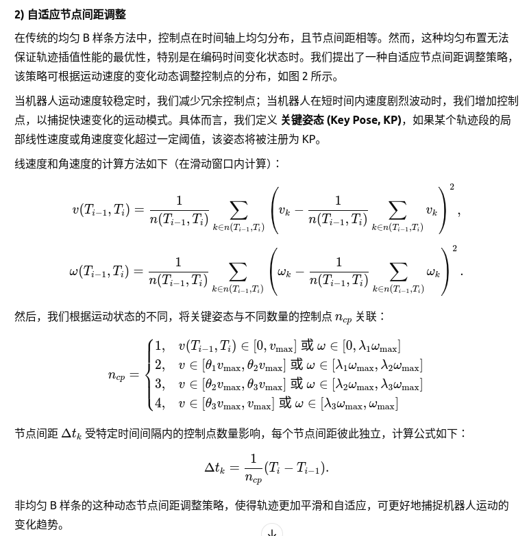
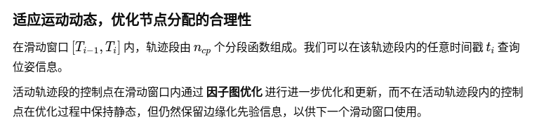
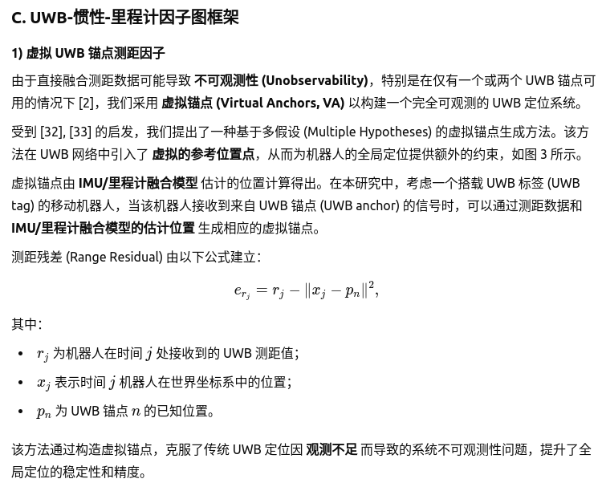
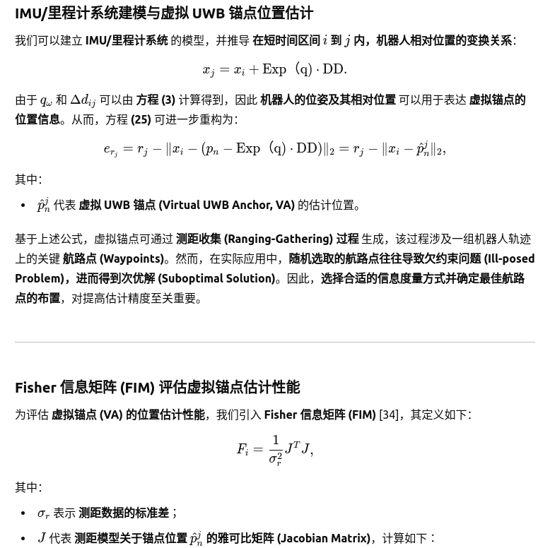
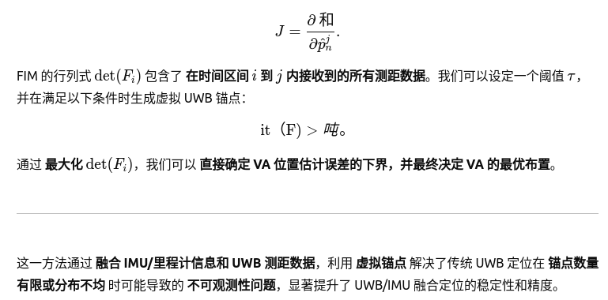
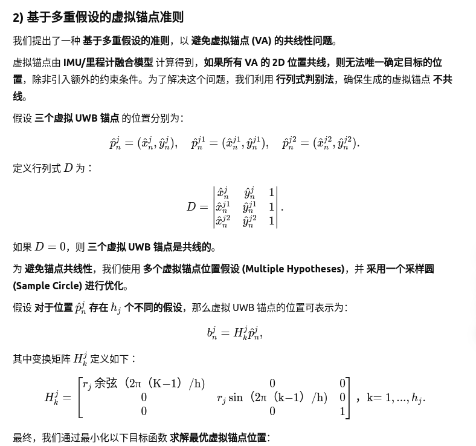
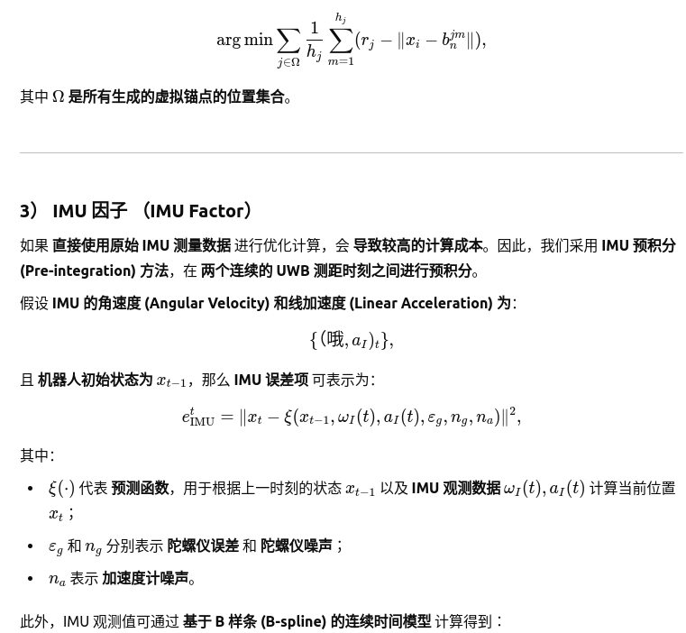
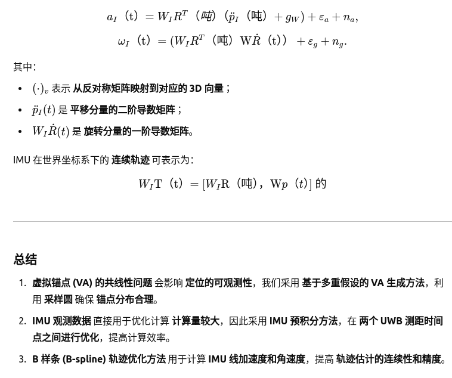
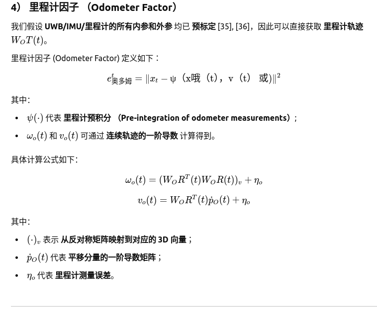
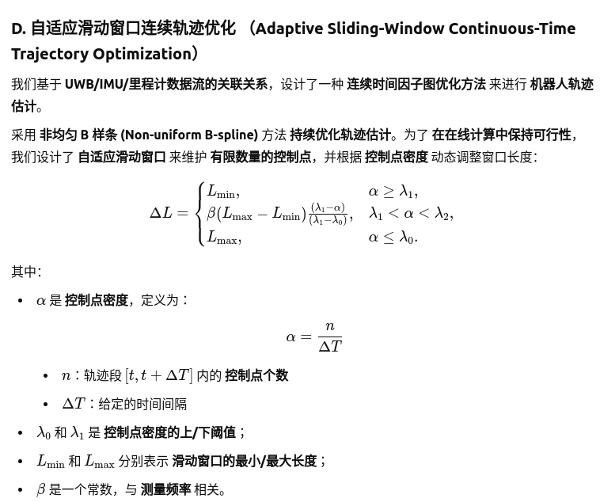
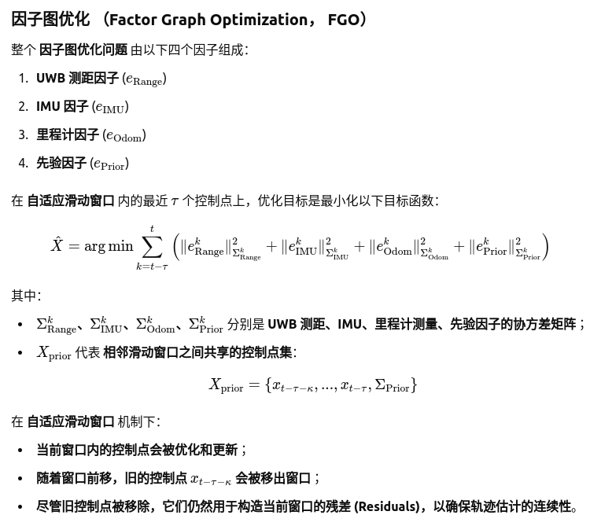
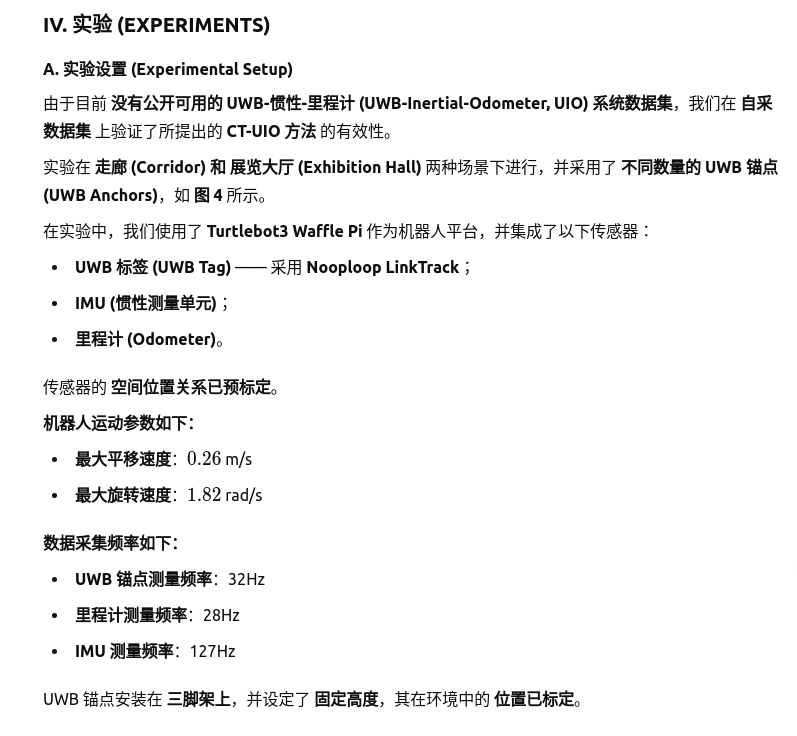
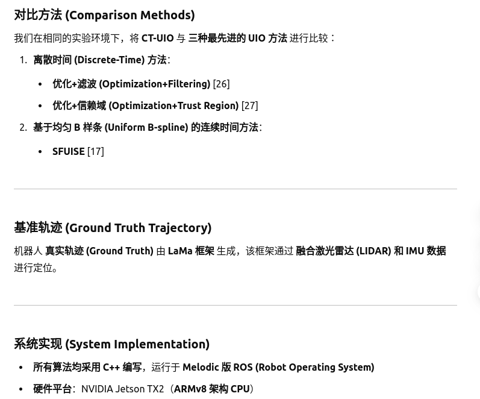
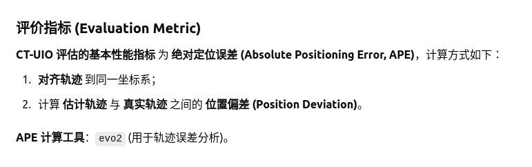
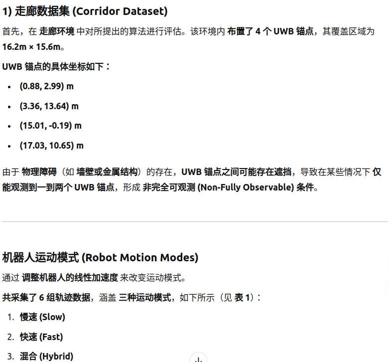
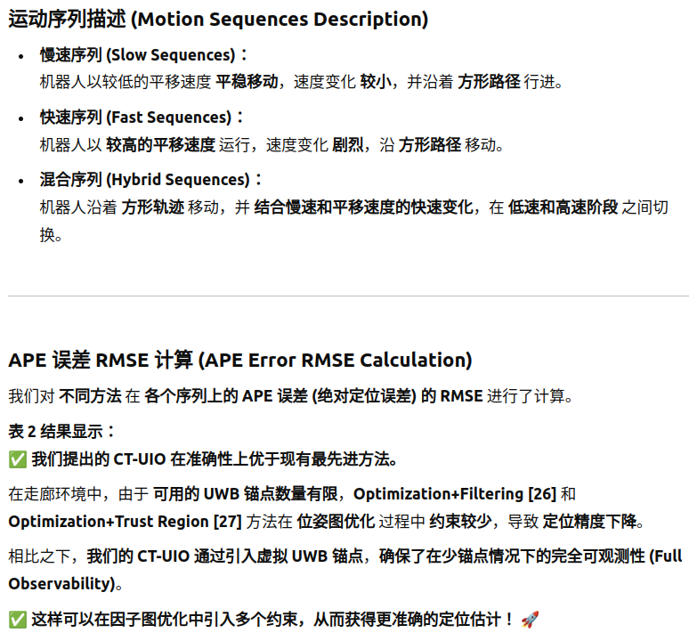
在像 **A-S1** 和 **A-S2** 这样的序列中，与 **基于均匀 B 样条的 SFUISE 方法** 相比，APE 的改善相对较小。在这些序列中，机器人移动较慢，所提出的 **自适应结点跨度调整** 并不一定会带来显著的性能提升。然而，在涉及 **快速线性运动** 的序列中，如 **A-J1** 和 **A-J2**，SFUISE 的误差显著增加。相比之下，**CT-UIO 在位姿插值的整体性能上优于现有最先进方法**。

在混合序列中，**CT-UIO 可以显著提高定位精度，APE 改进了 38.75%**。这一提升得益于 **自适应结点跨度调整策略**，该策略通过动态调整控制点的数量，**通过降低或增加结点跨度以适应不同的运动速度**。  

**图 5** 显示了走廊数据集中的轨迹概览，我们的方法在大多数序列中都能实现一致的运动轨迹。**图 6** 展示了所提出的 **自适应结点跨度调整策略** 在 **序列 A-H2** 中的应用示意。

### B. 展览大厅数据集

我们还在展览大厅数据集上评估了 **CT-UIO** 和其他最先进的方法。在这种情况下，两个 **UWB 锚点** 被放置在位置 **(4.52,10.68)m** 和 **(−1.71,−2.29)m**，以在 **20.0m × 11.6m** 的区域内创建非完全可观察的条件，并且 UWB 锚点之间没有遮挡。为了评估在急转弯情况下方法的有效性，我们提供了相应的 **旋转速度** 范围，表示急速运动的情况。总共收集了六个序列，具体见 **表 III**。

- **慢速序列**：机器人以低旋转速度和轻微的速度变化缓慢移动，沿波形路径行进。
- **快速序列**：机器人以大旋转速度和剧烈的速度变化移动，沿波形路径行进。
- **混合序列**：机器人沿波形轨迹行进，结合了慢速和快速旋转运动，包含低速和高速阶段。

**图 7** 显示了 **B-H2** 序列中控制点的分布。**图 8** 显示了展览大厅数据集中的轨迹概览。表 IV 总结了在六个序列上比较方法的 **APE 结果**。

实验结果显著表明，**CT-UIO 在定位性能方面总体上取得了改进**，即使在涉及快速转弯的序列中，仍然证明了其 **动态结点跨度调整策略** 的有效性。

此外，值得注意的是，当机器人经历快速旋转运动时，离散时间方法（如 **Optimization+Filtering [26]** 和 **Optimization+Trust Region [27]**）导致了 **APE 的增加** 或甚至表现出明显的定位偏差。与均匀 B 样条方法（**SFUISE**）相比，**CT-UIO** 通过调整控制点密度更好地捕捉了运动特征。具体而言，**CT-UIO** 在速度变化较小的部分减少了控制点的密度，在速度变化显著的部分增加了密度。而 **SFUISE** 无法适应轨迹的复杂性，因为它将结点跨度设置为整个轨迹中的常数值。此外，在只有两个 UWB 锚点的情况下，UWB 定位存在显著的精度下降。为了应对少量锚点系统中的可观察性问题，**CT-UIO** 通过将 **UWB 测距数据** 和来自 **IMU/里程计融合模型** 的运动先验结合，引入了虚拟锚点，提供了更全面的约束。基于此，所提出的 **CT-UIO** 即使在锚点有限的情况下，通过多个虚拟锚点测距约束，表现出强大的鲁棒性。

这些在走廊和展览大厅数据集中的实验结果证明，所提出的 **CT-UIO** 在涉及快速平移和旋转运动的情况下具有很高的有效性。在所有序列中，**CT-UIO 系统** 通过使用 **非均匀的连续时间轨迹表示** 保持了更稳定和一致的准确性。该策略有效地调整了控制点间隔，并确保更好地捕捉运动模式特征。

### V. 结论

本文提出了 **CT-UIO**，一种连续时间 **UWB-惯性-里程计定位系统**，旨在实现少锚点条件下的准确和鲁棒定位。**CT-UIO** 紧密集成了 **UWB 测距**、**IMU** 和 **里程计** 数据，采用非均匀 B 样条轨迹表示。具体而言，所提出的系统通过根据不同的运动速度自适应地放置控制点，在快速运动场景中提升状态估计精度。为了确保基于 **UWB** 的定位系统具有完全可观察性，**CT-UIO** 将 **UWB 测距** 与来自 **IMU/里程计融合模型** 的运动先验结合，生成虚拟锚点。此外，**CT-UIO** 的后端进行自适应滑动窗口因子姿态图优化，结合来自虚拟 **UWB 锚点测距**、**IMU** 和 **里程计测量** 的约束。

所提出的 **CT-UIO** 系统在多个真实世界的少锚点情境下，使用自收集的数据集进行了评估。与最先进的离散时间和连续时间估计方法相比，**CT-UIO** 在轨迹估计上始终表现出更一致和鲁棒的性能，特别是在快速运动场景下。

未来，值得探索在未知锚点位置的情况下实现所提出的 **CT-UIO** 定位系统，并结合其他传感器（如相机）来提高短期姿态估计的精度。