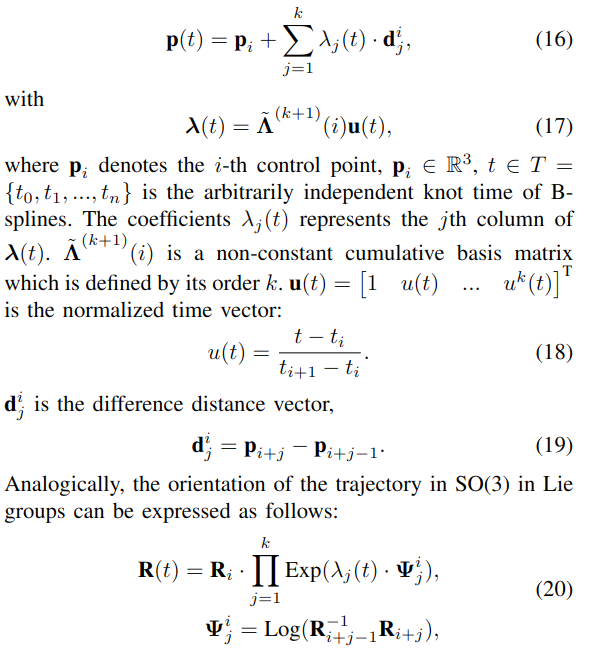
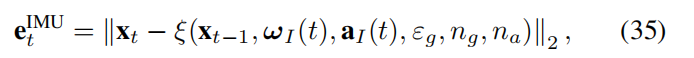

## 题目
- **UWB惯性里程计**
    - UWB：ultra-wideband，超宽带
- **B样条**
- non-uniform(非均匀)
- fewer anchors(较少锚点)
- IMU：inertial measurement unit，惯性测量单元
## 摘要
- 探讨问题：在锚点较少时，能源受限时，UWB定位技术
- 目前的研究：
    - 依赖：
        1. discrete-time representations(离散时间表示)
        2. **smoothness priors(光滑性先验)**推测机器人的运动状态
            - **smoothness priors(光滑性先验)**
    - 问题：无法确保多传感器数据同步
- 论文贡献：
    1. 提出一个**uwb惯性里程计定位系统**，利用**具有较少锚点的非均匀B样条框架**
    2. 引入一个**adaptive knot-span adjustment strategy(自适应节点跨度调整策略)**，用于非均匀连续时间轨迹表示
        - 一个方法表示轨迹
        - 方法实现：根据运动速度动态调整**控制节点**
            - 控制节点具体是什么，有什么作用?
    3. 提出**改进的扩展卡尔曼滤波(EKF)**，实现IMU和里程计数据的有效融合(efficient fusion)；基于创新的自适应评估(estimation)，给出短期精确运动先验
        - 多传感器数据融合，提供短期预计位置
    4. 提出基于多个假设(hypotheses)的Virtual Anchor(VA,虚拟锚点)生成方法，实现少锚点条件下的**完全可观测的**UWB定位系统
        - 给了一个虚拟锚点生成方法，但要满足很多假设
    5. 提出一个**基于自适应滑动窗口的CT-UIO因子图**，用于全局轨迹估计
  
    - 使用的数据集：corridor , exhibition hall

## 1.介绍
- 位置信息的应用：机器人工作中，轨迹预测、物体追踪、自动拣选操作
- 室内用UWB替代GNSS，UWB优势：稳定性、低成本、大规模部署中的可扩展性
- 传统利用UWB的方法：multilateration(三角测量)，需要至少3个锚点来给确定移动目标的2D位置
    - 问题：在某些情况或场景中，只能获得一个或两个锚点，该方法不适用
        - 例如energy-constrained UWB(能量受限的UWB)、deployment scenarios with spatial limitations(部署场景空间受限):狭窄的走廊、隧道
- 加入IMU和里程计传感器，
    提供环境无关的即时响应速度(instantaneous response velocity)，
    可以在连续的(consecutive)UWB测距测量之间构建相对位置约束(the construction of relative position constraints)
- 传统的传感器融合(fusion)方法：extended kalman filter(EKF,扩展卡尔曼滤波)，particle filter(PF,粒子滤波)
    - 问题：
        - 依赖smoothness priors推测机器人动作状态
        - 但基于discrete-time(DT,离散时间)轨迹预测，无法足够地**represent smoothness**
            - 因为interpolation schemes(插值方案)，在推测离散状态之间的机器人动作是不准确的
- 异步问题：多模态传感器配置(multi-modal sensor setups)可能有异步测量，在估计过程中需要同一时间点数据融合
- **连续时间表示**：
    - 应用在多传感器标定(multi-sensors calibration)、动作规划、目标追踪
    - 生成光滑轨迹，具有连续数据流
#### B-spline：通过一组控制点定义时间多项式(temporal polynomials)，表示轨迹，可以查询任意时刻局部性姿势(pose with locality)
- 现有方法
    - 需要：
        - 控制节点间距均匀，控制节点预先确定
        - 速度恒定假设
    - 问题：
        - 速度变化时，控制节点间距较小时，导致过拟合
### 论文贡献
1. 提出CT-UIO定位系统
    - 融合时间不同步的UWB测距、IMU、里程计
        - 如何融合？对应下面第2点
    - 适应少锚点场景和非均匀控制节点
        - 如何解决？
2. 利用自适应估计的EKF，构建IMU/里程计融合模型
    - 自适应是什么，如何实现？
    - 模型结果是什么？短期动作先验是什么？
3. 完整轨迹定位，结合UWB测距和上述短期动作先验给出  
    - 少锚点如何处理？
        - 好像是，多个假设虚拟锚点

## 2.相关概念
1. UWB定位系统：（激光）
    - 锚点：
        - 固定已知位置的UWB设备
        - 测量机器人与UWB设备距离
        - 多边测量，计算机器人位置
2. B样条：连续时间轨迹表示方法（离散位姿点-->连续平滑轨迹）
    - 分段多项式函数
3. 图 1. CT-UIO 框架：在预处理阶段，检测 UWB 测距数据并去除异常值。同时，使用自适应 EKF 融合 IMU 和里程计数据，以提供短期准确的运动先验。在前端，将 IMU/里程计融合模型的结果与 UWB 测距相结合，生成虚拟锚点。此外，基于 IMU/里程计融合模型的运动估计，自适应结点跨度调整策略非均匀地放置控制点。在后端，我们使用自适应滑动窗口进行全局轨迹估计的 CT-UIO 因子图。

## 3.系统概述
1. 初始化：UWB惯性里程计系统已经**标定**、**IMU偏差**、**里程计比例因子**初始化
2. 预处理：
    - 构建IMU/里程计融合模型
    - 去除UWB测距异常值（通过不等式约束）
3. 轨迹表示（时间-状态）：非均匀，连续；自适应节点间距调整策略
4. 建立因子图框架：生成虚拟锚点（结合IMU/里程计融合模型估计位置结果）
5. 轨迹优化：自适应滑动窗口，构建因子图，联合优化

#### 坐标系说明
- U：UWB坐标系
- I：IMU坐标系
- O：轮式里程计坐标系
- W：世界坐标系

### A.预处理
1. IMU/里程计融合模型
    - 1)计算时间间隔的相对运动位置
        - 原始IMU数据：角速度和局部线加速度
            - 
        - IMU计算采样时间间隔的相对运动位置
            - 
        - 对轮式里程计测量数据进行积分，里程计计算相对运动位置
            - 
    - 2)更新姿态
        - 
    - 3)创新扩展卡尔曼滤波
        - 构造包含IMU和里程计位姿的观测向量
        - 创新项；创新协方差矩阵定义
        - 
    - 4)评估IMU测量数据的可靠性
        - E(k)超过阈值thr时，舍弃该IMU数据
        - 
        - 
2. UWB测距异常值剔除
    - 利用IMU/里程计融合模型估计的位置d和速度v
        - 

### B.轨迹表示
1. 非均匀连续时间轨迹表示
    - 采用分割非均匀B样条，分别表示平移部分和旋转部分（两个函数）
    - 采用累计3次B样条函数，样条阶数为4（多项式阶数，决定平滑程度）
    - 
2. 自适应节点间距调整
    - 说明：机器人运动速度稳定时，减少冗余控制点；机器人速度剧烈波动时，增加控制点
    - 定义**关键姿态(KP)**：某个时间窗口，线速度或角速度变化超过阈值，该时间段对应的姿态被注册为KP
        - 
    - 定义控制点数量：与变化大小有关
        - 
    - 节点间距：
3. 额外说明：
    - 

### C.UWB-惯性-里程计因子图框架
1. 虚拟UWB锚点测距因子
    - 生成虚拟锚点：
        - 机器人接受UWB锚点的信号，测距
        - 结合IMU/里程计融合模型的估计位置
        - 生成相应虚拟锚点
    - 评估虚拟锚点性能：Fisher信息矩阵(FIM)
    - 最大化det(F)获取虚拟锚点最优布置
    - 解决虚拟锚点共线性问题
        - 3个虚拟锚点行列式非零
        - 多个虚拟锚点的位置假设，采用采样圆优化
2. IMU因子
    - 两个连续UWB测距时刻之间，进行IMU预积分
    - IMU观测值可以由基于B-样条的连续时间模型计算得到，获取IMU轨迹
        - 误差项
3. 里程计因子
    - 可以直接获取里程计轨迹
        - 误差项

### D.轨迹优化
- 

## 4.实验
1. 实验设置
    - 数据集：论文作者自采
    - 场景：走廊，展览大厅
    - 机器人：Turtlebot3 Waffle Pi
        - 集成传感器：UWB标签，IMU，里程计
        - 传感器空间位置已经预标定
        - 运动参数：
            - 最大平移速度：0.26m/s
            - 最大旋转速度：1.882rad/s
        - 数据采集频率：
            - UWB锚点：32Hz
            - IMU：127Hz
            - 里程计：28Hz
    - 系统实现：
        - C++编写算法
        - 运行在Melodic 版 ROS上
        - 硬件平台：ARMv8 架构的 CPU（NVIDIA Jetson TX2）
2. 对比实验
    - 基准轨迹：由LaMa框架生成，融合激光雷达和IMU数据进行定位
    - 其他UIO方法
        - 离散时间方法（Optimization+Filtering [26] ）
        - 离散时间方法（Optimization+Trust Region [27]）
        - 基于均匀 B 样条的连续时间方法（SFUISE [17]）
3. 评估指标：绝对定位误差(APE)
    - 计算工具evo2
    - 估计轨迹与真实轨迹的位置偏差
    - 

