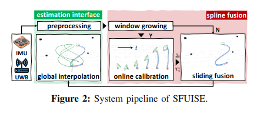
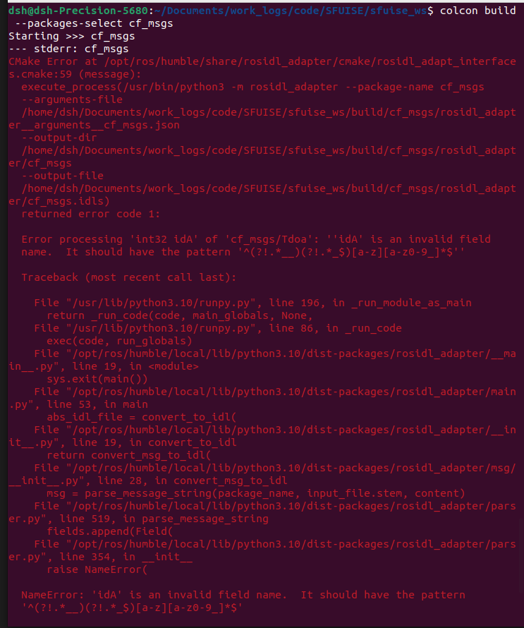
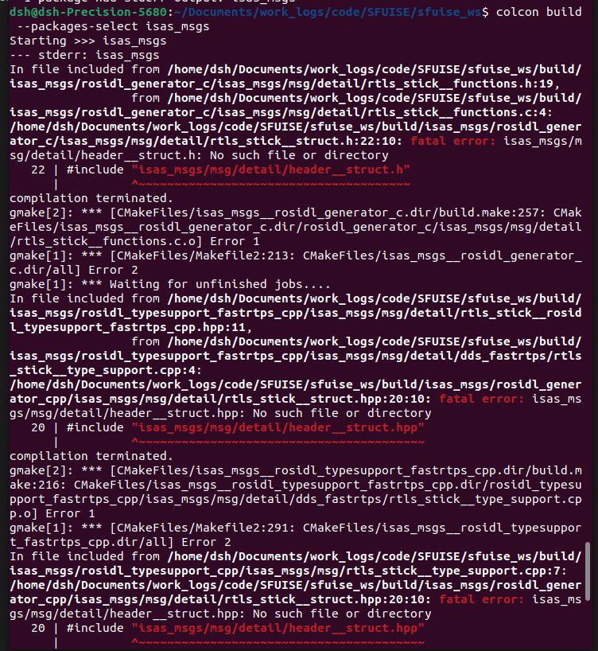

- sfuise系统
- 
## sfuise/src/EstimationInterface.cpp
- 对应sfuise系统的估计接口部分
- main:
    - 创建ros节点
    - EstimationInterface实例
- EstimationInterface类：
    - 读取参数配置
        - 参数来历TDOA：sfuise_test_util.launch--->config/config_test_util.yaml
        - 参数来历TOA：sfuise_test_isas-walk1.launch--->config/config_test_isas-walk1.yaml
    - 读取控制点帧率，计算时间间隔

    | 订阅话题 | 话题名 |其他说明|
    | --- | --- | --- | 
    | 启动时间 | "/SplineFusion/start_time" |
    | IMU数据 | "/waveshare_sense_hat_b" |
    | UWB数据 | "/rtls_flares" |
    |TDOA/RTLS（TDOA:一种UWB数据；RTLS：UWB自建数据集）|"/tdoa_data"或"/rtls_flares"|
    |锚点列表(仅RTLS)|"/anchor_list"|如果是TDOA，则从文件中获取|
    |VIVE跟踪器数据/位姿数据|"/vive/transform/tracker_1_ref"或"/pose_data"|获取地面真实位置信息|
    |系统标定数据|"/SplineFusion/sys_calib"|设置导航数据|
    |估计窗口数据|"/SplineFusion/est_window"|处理样条节点，如果启用导航UWB，则发布优化结果|

    | 发布话题 | 话题名 |
    | --- | --- |  
    | IMU数据 | "imu_ds" |
    |TDOA/RTLS话题（TDOA:一种UWB数据；RTLS：UWB自建数据集）|"tdoa_ds"或"toa_ds"|
    |锚点可视化点云|"visualization_anchor"|
    |锚点列表|"anchor_list"|
    |旧的B样条优化路径(坐标系为map)|"bspline_optimization_old"|
    |当前B样条优化窗口|"bspline_optimization_window"|
    |优化位姿的可视化标记，并设置优化位姿可视化的颜色|"opt_pose"|

### 样条处理


## sfuise/src/SplineFusion.cpp
- 对应sfuise系统的样条融合部分
- main:
    - 创建ros节点
    - SplineFusion实例
    - 执行样条融合(run)
- SplineFusion类:
    - 读取参数配置
        - 参数来历TDOA：sfuise_test_util.launch--->config/config_test_util.yaml
        - 参数来历TOA：sfuise_test_isas-walk1.launch--->config/config_test_isas-walk1.yaml

    | 订阅话题 | 话题名 |其他说明|
    | --- | --- | --- | 
    |IMU数据|"/EstimationInterface/imu_ds"|
    |锚点列表|"/EstimationInterface/anchor_list"|
    |TDOA/RTLS|"/EstimationInterface/tdoa_ds"或"/EstimationInterface/toa_ds"|
    

    | 发布话题 | 话题名 |
    | --- | --- |  
    |活动控制点的点云消息|"active_control_points"|
    |非活动控制点的点云消息|"inactive_control_points"|
    |系统校准消息|"sys_calib"|
    |估计窗口消息|"est_window"|
    |启动时间消息|"start_time"|

- run函数：
    - 初始化：
        - 时间同步：获取IMU、TOA、TDOA缓冲区的最新时间戳，确定当前滑动窗口的时间范围。
        - 控制点动态扩展：根据传感器数据动态扩展样条（Spline）的控制点（Knots），若最新传感器数据时间超过当前样条的最大时间（min_time > spline_local.nextMaxTimeNs()），需添加新控制点。
        - 状态初始化：
            - IMU主导模式（if_uwb_only = false）：（TOA）
                - 使用 IMU预积分 推算下一节点的姿态（q_ini）和位置（pos_ini）。
            - 纯UWB模式（if_uwb_only = true）：（TDOA）
                - 通过 TDOA多边定位（tdoaMultilateration）估计初始位置。
                - 姿态初始化为单位四元数（假设初始无旋转）。
        - 初始化参数和样条
    - 显示控制点
        - 发布活动控制点和非活动控制点
        - 位置信息来源：spline_local
    - 执行优化
        - 节点数小于2,返回0
        - UWB分类：不在优化中的拒绝UWB，**在优化中的拒绝UWB**，不拒绝UWB
        - 如果窗口计数达到校准数，则不优化重力，不优化变换
        - 更新IMU测量，更新tdoa/toa
        - 更新线性化器大小
            - 如果不只使用UWB，则添加IMU数据
        - **迭代优化**：基于LM算法迭代优化过程
            1. 创建线性化器
            2. 遍历IMU、TDOA、TOA数据窗口，累加各传感器的残差项到优化问题中
            3. 收敛性检查
            4. 求解增量：阻尼项计算，求解线性系统
            5. 步长评估与调整：备份状态，应用增量，步长质量评估
            6. 终止条件：梯度足够小（收敛），增量或相对误差变化低于阈值（局部最优），lambda达到上限（无法进一步优化）
    - 更新窗口计数，更新窗口数
    - 创建样条消息，并获取样条消息
    - 发布估计消息
    - 显示处理后的控制点

### 迭代优化
    - LM自适应阻尼：通过lambda动态调整高斯-牛顿法和梯度下降的权重。

 
## 测试代码命令
- 在 UTIL (TDoA-inertial)上运行 sfuise 的示例：
    - `roslaunch sfuise sfuise_test_util.launch`
    - `rosbag play const1-trial1-tdoa2.bag`
- 在 ISAS-Walk (ToA-inertial，自建数据集) 上运行 sfuise 的示例：
    - `roslaunch sfuise sfuise_test_isas-walk1.launch`
    - `rosbag play ISAS-Walk1.bag`


## 转为ros2
### 问题
1. 
- ros2消息名称不能有大写
- 修改了Flow.msg,Tdoa.msg

2. 
- 修改了RTLSStick.msg：std_msgs/Header header

3. `sudo apt install ros-humble-visualization-msgs`

4. `ros2 topic echo /EstimationInterface/imu_ds`没有输出
- 修改 main
- 删除/EstimationInterface,/SplineFusion前缀

5. spline_local相关数据


### sfuise主文件改写
- launch文件
- src中主文件
    - EstimationInterface
    - SplineFusion
- include
- CMakeLists.txt
- package.xml
- 数据集


## ros2数据集获取
- 参考：https://gitlab.com/ternaris/rosbags
- 将.bag转换为.db3：`rosbags-convert --src ros1.bag --dst ros2bag/`
- 播放：`ros2 bag play ros2-walk1`

## spline_local.nextMaxTimeNs()

### 一、什么是 `nextMaxTimeNs()`？

这个函数名表示的是：
- `nextMaxTimeNs()`：**返回下一个样条段的最大时间戳**，单位是纳秒（`ns` = nanoseconds）。

它通常用于轨迹插值或预测过程中，确定当前插值是否需要“前进”到下一个样条段。

---

### 二、它的值由哪些因素决定？

1. **轨迹规划中的时间断点（time knots）**
   - 样条曲线是按时间分段的，比如：  
     `t0, t1, t2, ..., tn`  
     每个时间段 `[ti, ti+1]` 都对应一段样条。
   - `nextMaxTimeNs()` 可能就表示当前段的终止时间 `ti+1`，单位转换成纳秒。

2. **当前插值所处的段落**
   - 如果当前插值正在 `ti` 到 `ti+1` 的区间中，`nextMaxTimeNs()` 返回的就是 `ti+1`（ns）。

3. **时间单位转换**
   - 如果原始时间是以秒（s）表示的，那么会乘以 `1e9` 转成纳秒。

---

### 三、举个例子

假设你有以下轨迹时间节点（单位：秒）：

```python
time_knots = [0.0, 1.0, 2.5, 4.0]  # 四段样条，共三个 segment
```

- 当前插值在第 1 段，即 `[1.0, 2.5]`  
  那么 `nextMaxTimeNs()` 返回的就是 `2.5 * 1e9 = 2_500_000_000 ns`

---

### 四、常见库中的用法

- **Cyber RT (Apollo)** 中的 spline 插值器里有 `next_max_time_ns()`，它根据 `segment_index + 1` 的 knot 时间计算得到。
- **Google Cartographer** 或其他 SLAM 中，如果使用样条进行轨迹重建，也有类似行为。
非常棒！你提到：

> `SplineState spline_local;`

咱们就可以更精确地回答：  
**`spline_local.nextMaxTimeNs()` 的值由什么决定？**

---

## ✅ 一、背景：`SplineState` 是什么？

在很多 ROS2 + 优化/插值相关项目中（比如基于 kalibr、VINS-Fusion、imu-preintegration、自研 VIO/SLAM 系统等），`SplineState` 通常是一个**自定义的样条状态管理类**，它的核心职责是：

- 管理多个控制点（knot）；
- 支持状态插值（位置、姿态、IMU bias）；
- 与 IMU / camera 时间戳对齐；
- 维护最大插值范围（如 `nextMaxTimeNs()`）；

---

## ✅ 二、核心问题：`spline_local.nextMaxTimeNs()` 的值由什么决定？

👇 **结论如下**：

```cpp
nextMaxTimeNs = start_time_ns + (number_of_knots + order - 1) * dt_ns;
```

> 🧠 **其中常见的是三次 B-spline（order = 4）**

所以在你这段代码中：

```cpp
spline_local.init(1e8, 0, 0); // dt_ns = 1e8 ns，起始时间 = 0
int num = 1;
for (int i = 0; i < num; i++) {
    spline_local.addOneStateKnot(...);
    next_knot_time_ns += dt_ns;
}
```

### 📌 变量回顾：

| 变量 | 含义 |
|------|------|
| `start_time_ns = 0` | spline 起始时间 |
| `dt_ns = 1e8` | 控制点时间间隔：100ms |
| `num = 1` | 添加了 1 个控制点 |
| `order = 4` | 默认三次 B-spline |

---

## ✅ 三、结果计算：

```
nextMaxTimeNs = 0 + (1 + 4 - 1) * 1e8 = 3 * 1e8 = 3 0000 0000 ns
```

也就是 **300ms**。

---

## ✅ 四、图示理解（直观感受）

```text
时间轴（每个“*”是一个控制点）：

0         100ms       200ms       300ms
|----------|------------|------------|
*          -            -            -

你只添加了一个控制点（红色 *），但 B-spline 需要4个 knot 才能插值，因此：
- 当前能插值的最大时间 = 最后一个 knot 能支持插值的终点
- 这通常就是：起始时间 + 3 × dt_ns = 300ms
```

---

## ✅ 五、相关源码（可能实现）

如果 `SplineState` 类定义如下（典型写法）：

```cpp
uint64_t SplineState::nextMaxTimeNs() const {
    return start_time_ns_ + (knot_count_ + order_ - 1) * dt_ns_;
}
```

或者某些库里：

```cpp
uint64_t SplineState::nextMaxTimeNs() const {
    return knot_times_.back() + 3 * dt_ns_; // 最后一个控制点 + 插值段
}
```

---

## ✅ 六、小结一句话：

```cpp
spline_local.nextMaxTimeNs() 的值 = 起始时间 + (控制点数量 + 样条阶数 - 1) × dt_ns
```

在你提供的代码中，这个值正好是 **300,000,000ns（300ms）**。

--

## **说明spline_local工作逻辑**

`spline_local` 通常是一个用于 **轨迹插值或拟合的局部样条对象**，在如 ROS 2、SLAM、状态估计器或传感器融合框架中，它负责在一段时间范围内构建连续平滑的位姿（或其他状态）的表示，并允许在这段时间内查询任意时间点的状态。

下面是它的常见工作逻辑说明👇：

---

## ✅ 1. **初始化（建模）**

`spline_local` 通常从一段轨迹数据（比如 IMU、里程计或优化后的轨迹点）中，构建一个 **局部样条模型（Local Spline）**：

```cpp
spline_local.setKnots({t0, t1, t2, ..., tn});
spline_local.fit(states);  // 传入各个时间点对应的状态（位姿、速度等）
```

- 每个时间段 `[ti, ti+1]` 会生成一段多项式（例如贝塞尔曲线、B样条、三次样条等）；
- 这些曲线拼接成一个整体轨迹，能在任意时间 `t ∈ [t0, tn]` 上插值。

---

## ✅ 2. **插值查询**

在运行时，可以在当前 spline 的时间范围内进行状态查询：

```cpp
if (query_time_ns <= spline_local.nextMaxTimeNs()) {
    Pose pose = spline_local.evaluate(query_time_ns);
}
```

- 插值常用于传感器对齐（IMU → 相机），预测状态，或者用于视觉惯导系统中状态传播。

---

## ✅ 3. **时间窗口推进**

`spline_local` 一般只包含 **局部的一段轨迹**（例如当前时刻前后 2 秒），随着时间推进，如果传感器数据更新，它也需要更新：

```cpp
if (min_time > spline_local.nextMaxTimeNs()) {
    spline_local.popFrontSegment();  // 丢掉过期段
    spline_local.appendSegment(new_state);  // 加入新的一段
}
```

或重新构建整个 spline：

```cpp
spline_local.rebuild(new_knots, new_states);
```

---

## ✅ 4. **关键接口说明（假设）**

以下是 `spline_local` 可能暴露的几个关键函数（伪代码）：

| 接口 | 含义 |
|------|------|
| `evaluate(t)` | 插值获取时间 `t` 对应的状态 |
| `nextMaxTimeNs()` | 当前 spline 段支持的最大插值时间（结束点） |
| `setKnots()` | 设置时间节点（分段点） |
| `fit(states)` | 拟合状态数据以生成 spline |
| `popFrontSegment()` | 删除最旧的一段 spline |
| `appendSegment()` | 添加一段新的 spline |
| `rebuild()` | 重新构建整个 spline（例如轨迹优化之后） |

---

## ✅ 5. 常见用途

- **状态估计器中的轨迹拟合**（如 VINS、MSCKF）；
- **轨迹平滑**；
- **IMU 插值**；
- **相机时间对齐**；
- **基于时间的 map fusion**；
- **实时路径跟踪**。

---

## ✅ 图解：spline_local 时间滑窗结构

```
Time axis →
|------|------|------|------|
t0     t1     t2     t3     t4  ← knots
  [ spline_local 管理的当前段 ]
  
当前查询时间： t_query ∈ [t1, t3]
→ 可通过 evaluate(t_query) 获取状态
→ 超出 t3 就需要扩展 spline 或重建
```

---

## ✅ 总结一句话

> `spline_local` 是一个局部轨迹插值器，它通过样条曲线拟合一段时间范围内的状态（如位姿），支持在这段时间内快速查询状态，用于多传感器同步、状态估计或轨迹重建。在时间滑动过程中需要不断更新其支持范围。


## executor.spin_some()与ros::spinOnce()的区别

好问题！这两个函数看起来类似，但它们的**背后执行机制和使用场景在 ROS 2 和 ROS 1 中是有区别的**。

---

## ✅ 简要对比总结：

| 函数 | 所属 | 含义 | 用途 |
|------|------|------|------|
| `ros::spinOnce()` | **ROS 1** | 单次处理一次回调队列 | 常用于循环控制结构中 |
| `executor.spin_some()` | **ROS 2** | `Executor`（执行器）处理当前可用回调一次或多次 | 常用于精细控制 ROS 2 回调执行 |

---

## ✅ 详细说明

### 🟦 ROS 1: `ros::spinOnce()`

- 来自 `roscpp`（ROS 1）
- 功能：**只处理一次当前所有挂起的回调函数**（如果有的话）
- 常用于手动控制 ROS 1 回调处理，比如配合 `while (ros::ok())` 的自定义控制循环：

```cpp
ros::Rate loop_rate(10);
while (ros::ok()) {
    doSomething();
    ros::spinOnce();  // 处理一次回调
    loop_rate.sleep();
}
```

---

### 🟩 ROS 2: `executor.spin_some()`

- 属于 ROS 2 的 `rclcpp::Executor` 类方法
- 功能：**从当前节点的回调队列中处理一部分或全部可运行回调，非阻塞**
- 一般和自定义循环一起使用：

```cpp
rclcpp::executors::SingleThreadedExecutor executor;
executor.add_node(node);

while (rclcpp::ok()) {
    executor.spin_some();  // 处理当前所有可用的回调，非阻塞
    doYourOwnLogic();
}
```

---


## ✅ 和 `rclcpp::spin()` 的对比（加深理解）

| 方法 | 是否阻塞 | 作用 |
|------|-----------|------|
| `rclcpp::spin()` | ✅ 阻塞 | 一直运行，自动处理回调直到节点关闭 |
| `executor.spin_some()` | ❌ 非阻塞 | 手动处理一部分回调，用于自定义控制循环 |
| `ros::spinOnce()`（ROS 1） | ❌ 非阻塞 | 类似用途，但是 ROS 1 的写法 |

---

## ✅ 使用建议

- 如果你需要在 **主线程中插入自己的逻辑（如定时器/控制循环）**，就可以用：
  - ROS 1: `ros::spinOnce();`
  - ROS 2: `executor.spin_some();`

- 如果你希望让 ROS 自己一直运行直到中断，就可以用：
  - ROS 1: `ros::spin();`
  - ROS 2: `rclcpp::spin(node);`

---
