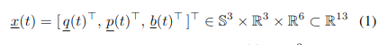

### 题目：连续时间超宽带惯性融合
### 摘要：

摘要——我们介绍了一种新型的连续时间超宽带-惯性融合框架，用于在线运动估计。利用基于四元数的三次累积 B 样条对运动状态进行连续参数化。进一步提供了系统化的解析运动插值和空间微分推导。在此基础上，建立了一种新的滑动窗口样条拟合方案，用于异步多传感器融合和在线校准。我们对四元数样条拟合方法进行了专门的验证，并使用公共数据集和实验评估了所提出的系统，SFUISE（基于样条融合的超宽带-惯性状态估计）。所提出的传感器融合系统具有实时能力，并在性能上优于最先进的离散时间方案。我们在 https://github.com/KIT-ISAS/SFUISE 上发布了源代码和自己的实验数据。

### 1. 引言
- 贡献

我们引入了基于样条融合的超宽带-惯性状态估计方案 SFUISE（第 II 节）。以基于四元数的三次累积 B 样条作为状态表示的骨干，对解析运动插值和雅可比矩阵进行了系统化和统一的推导(第 III 节)。基于此，建立了一种高效的滑动窗口样条插值方案，用于融合原始时间戳下的 UWB-Inertial 读数，并增加了在线校准的选项（第 IV 节）。首先进行一项专门的研究以验证四元数样条插值方案的可行性。随后，我们使用公开数据集和实验评估了 SFUISE 在 UWB-Inertial 跟踪中的表现，包括与最先进的离散时间融合方案的比较（第 V 节）。所提出的系统在实时性能上优于离散时间方案。考虑到所提出方案在广泛场景中的通用性，我们将我们的实现和自己的实验数据集开源。

### 2. 系统概述
- 目标：估计运动相关的变量（变量随时间变化）
    - 
    - q:方向（四元数）；p:位置；b:加速度计和陀螺仪偏差
- sfuise系统：
    - 
    - 两部分：估计接口，样条融合
    - 它由估计接口和样条融合的功能核心组成。异步 UWB 和 IMU 测量首先进行预处理，以进行可能的下采样，然后在有限的时间窗口内拟合三次累积 B 样条。随着传感器数据的流入，样条融合窗口首先增长到预先给定的宽度，然后滑动，相对于当前时间戳进行在线状态估计。在增长阶段，执行额外的在线校准以获得重力向量 g 和从世界（W）到 UWB（U）帧的转换 T。此外，样条融合给出的节点估计被发送回估计接口，在那里维护一个全局样条并进行插值以进行可视化。

### 3. 累积 B 样条的状态估计
- 连续时间状态模型
    - 

### 4. 持续时间超宽带-惯性融合