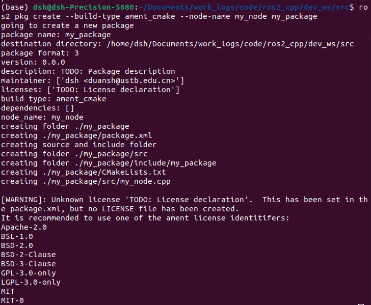
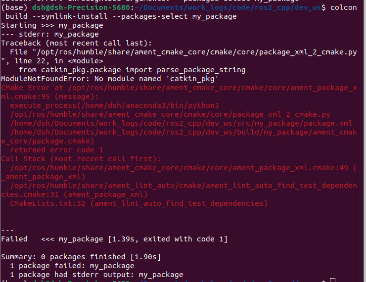

## 测试代码：code/ros2_cpp中
## 参考网址：https://www.ncnynl.com/archives/201806/2486.html
## 新参考网址：https://fishros.org/doc/ros2/humble/Tutorials/Beginner-Client-Libraries/Creating-A-Workspace/Creating-A-Workspace.html
## 问题：
1. 

### **问题分析**
此警告表明ROS2功能包的 `package.xml` 文件中未正确声明许可证类型，且未生成对应的 `LICENSE` 文件。ROS2的构建系统（`ament`）要求明确指定开源许可证类型以保证合规性。

---

### **解决方案**
#### **1. 修改 `package.xml` 中的许可证声明**
在功能包的 `package.xml` 文件中，找到 `<license>` 标签，将其内容替换为 **ament支持的许可证标识符**（如 `Apache-2.0`、`MIT` 等）。例如：

```xml
<license>Apache-2.0</license>  <!-- 推荐使用Apache-2.0 -->
```

#### **2. 创建 `LICENSE` 文件**
在功能包的根目录下创建一个名为 `LICENSE` 的文本文件，内容需与 `package.xml` 中声明的许可证一致。以下是常见许可证的操作方法：

##### **示例：Apache-2.0 许可证**
1. 访问 [Apache-2.0 许可证模板](https://www.apache.org/licenses/LICENSE-2.0.txt) 复制全文。
2. 在功能包根目录创建文件：
   ```bash
   cd ~/ros2_ws/src/my_package
   touch LICENSE
   ```
3. 将许可证文本粘贴到 `LICENSE` 文件中。

---

### **常见许可证选择建议**
| **许可证类型** | **适用场景**                              | **限制要求**                                                                 |
|----------------|-----------------------------------------|-----------------------------------------------------------------------------|
| **Apache-2.0** | 商业友好，允许修改和闭源分发              | 需保留版权声明和变更说明，明确专利授权                                      |
| **MIT**        | 极简宽松，适合个人或小规模开源项目        | 仅需在衍生代码中保留原许可证声明                                            |
| **BSD-3-Clause** | 类似MIT，但禁止使用作者名进行推广       | 需包含版权声明和免责条款                                                    |
| **GPL-3.0**    | 强制衍生代码开源，适合强开源社区项目      | 任何基于此代码的修改必须开源                                                |

选择许可证时，请根据项目需求和分发策略谨慎决定。对于ROS2社区项目，**Apache-2.0** 是最常见的选择。

2. 
---

### **问题分析**
此错误是由于在ROS2的构建过程中，Python解释器路径指向了Anaconda环境（`/home/dsh/anaconda3/bin/python3`），而Anaconda环境中缺少ROS2依赖的Python包 `catkin_pkg`。ROS2的构建工具链需要系统原生Python环境（如 `/usr/bin/python3`）而非conda环境。

---

### **解决方案**
#### **1. 退出Anaconda环境**
在终端输入以下命令退出conda环境（如果当前处于conda的`base`环境）：
```bash
conda deactivate
```
此时终端提示符应不再显示 `(base)`。

#### **2. 确保ROS2环境已激活**
重新激活ROS2环境（假设使用ROS2 Humble）：
```bash
source /opt/ros/humble/setup.bash
```

#### **3. 安装 `catkin_pkg`（仅限原生Python环境）**
在原生Python环境（非conda）中安装 `catkin_pkg`：
```bash
# 使用pip3安装（需确保pip3指向系统Python）
sudo apt-get install python3-pip  # 如果未安装pip3
pip3 install --user catkin_pkg
```

#### **4. 重新编译功能包**
重新运行编译命令：
```bash
cd ~/Documents/work_logs/code/ros2_cpp/dev_ws
colcon build --symlink-install --packages-select my_package
```

---

### **验证环境路径**
- **检查Python解释器路径**：
  ```bash
  which python3
  ```
  正确输出应为 `/usr/bin/python3`，而非Anaconda路径。

- **检查环境变量**：
  ```bash
  echo $PYTHONPATH
  ```
  应包含ROS2相关路径（如 `/opt/ros/humble/lib/python3.10/site-packages`）。

---

### **备选方案：强制使用系统Python**
如果仍需在conda环境中操作，可临时指定系统Python路径：
```bash
export PYTHONPATH=/usr/lib/python3/dist-packages:$PYTHONPATH
export PATH=/usr/bin:$PATH
```
但此方法可能导致其他conda包冲突，建议优先退出conda环境。

---

### **附加说明**
- **ROS2与Anaconda的兼容性**：ROS2官方未对Anaconda环境提供官方支持，推荐使用原生Python环境。
- **长期解决方案**：在 `~/.bashrc` 中注释掉conda初始化代码，避免默认进入conda环境：
  ```bash
  # 注释掉类似以下行
  # export PATH="/home/dsh/anaconda3/bin:$PATH"
  ```
  然后执行 `source ~/.bashrc` 生效。

通过上述步骤，可解决因Python环境冲突导致的构建失败问题。

## 换参考网址了