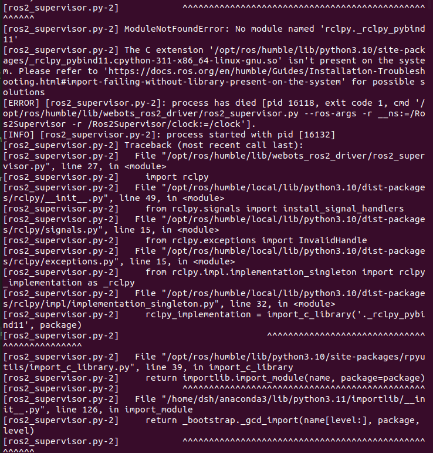

### 工作空间功能
- 开启webots中的epuck机器人
- 修改webots中的机器人和世界
### 代码来源
- 代码来自官方代码中的E-puck相关代码
- 地址：https://github.com/cyberbotics/webots_ros2/tree/master/webots_ros2_epuck


### 修改内容
- 修改包名为webots_epuck
- 修改launch文件名为my_launch.py，
- 修改resource/epuck_webots.urdf，启用摄像机与深度相机，"range-finder"
```
        <device reference="range-finder" type="RangeFinder">
            <ros>
                <topicName>/range_finder</topicName>
                <enabled>true</enabled>
                <alwaysOn>true</alwaysOn>
            </ros>
        </device>
```
- 修改worlds/epuck_world.wbt，给epuck加深度相机
```
E-puck {
  translation -0.5 -0.5 0.001
  rotation 0 0 1 3.1415
  controller "<extern>"
  version "2"
  camera_width 640
  camera_height 480
  turretSlot [
    InertialUnit {
      name "imu"
      resolution 0.001
    }
    Pi-puck {
    }
    RangeFinder {
      fieldOfView 0.7
      width 320
      height 240
    }
  ]
}
```
----------------
- 修改resource/epuck_webots.urdf，添加IMU传感器
- 修改worlds/epuck_world.wbt，添加IMU传感器

### 使用方法
- ros2 launch webots_epuck my_launch.py rviz:=true


### 遇到的问题：
- 
    - 解决：退出conda环境